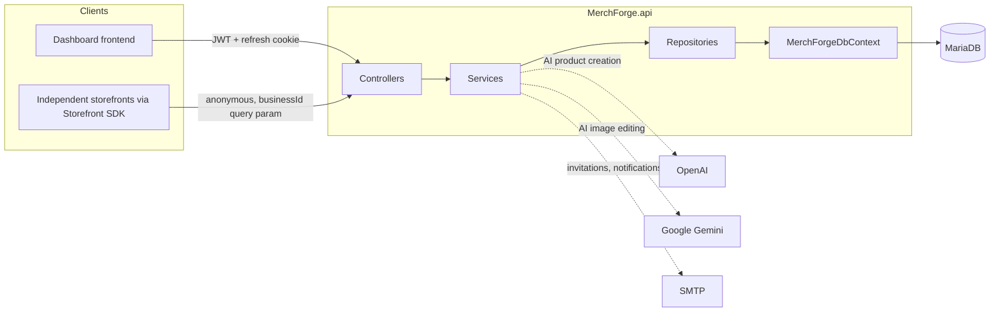

# MerchForge Backend Documentation

`MerchForge.api` is the backend for MerchForge: a multi-tenant platform where aMR-docsV01
business owner creates a store ("business"), builds a product catalog — manually or
through an AI chat assistant — and gets a public storefront that independent
frontend deployments (via a Storefront SDK) can read from. This documentation set
was produced by direct inspection of the codebase on branch `MR-docsV01`, and
reflects the implementation as it actually exists, not an idealized or planned
design.

## Tech stack

| Layer | Technology |
|---|---|
| Runtime | .NET 10, ASP.NET Core Web API (controller-based, not Minimal APIs) |
| Database | MariaDB / MySQL, via EF Core 9 + `Pomelo.EntityFrameworkCore.MySql` |
| Authentication | JWT bearer access tokens + hashed, database-backed refresh tokens in an `HttpOnly` cookie |
| Background jobs | Hangfire, backed by the same MariaDB database |
| Validation | FluentValidation |
| Email | MailKit/MimeKit over SMTP |
| AI — product creation | OpenAI Chat Completions (structured outputs) + Whisper transcription |
| AI — image editing | Google Gemini (Interactions API) |
| API docs | Swashbuckle (Swagger UI, Development only) |

Full package list with versions and purposes: [dependencies.md](dependencies.md).

## Architecture at a glance

Full layer-by-layer breakdown, the DI registration pattern, the service catalog, and
the background-job system: [architecture.md](architecture.md).

## How the major flows work

- **A business is born from an invitation.** There's no open self-signup: a
  `SystemAdmin` issues a business-owner invitation, the invitee redeems it with a
  single call that atomically creates their `User`, `Business`, initial
  `BusinessUser` membership, and any custom categories/metadata fields they chose.
  → [authentication.md](authentication.md)
- **A product is created two ways, converging on one path.** Either a merchant
  fills in a form (`SaveProductRequest` → `BusinessDashboardService.CreateProductAsync`),
  or they describe it to an AI chat assistant that assembles the same shape over
  several turns and calls the identical `CreateProductAsync` on confirmation.
  → [ai/product-generation.md](ai/product-generation.md),
  [products/product-management.md](products/product-management.md)
- **A product photo can be AI-edited independently of product creation.** One
  request, one or more already-uploaded images, one text/voice instruction, one
  edited image out — no conversation, no multi-step state.
  → [ai/image-editing.md](ai/image-editing.md)
- **Both AI features are metered by credits, not hard-gated.** A business either
  has a feature bundled in its subscription plan (unlimited use) or has bought
  credit packages for it independently (one credit spent per successful AI call,
  never for a failed one). → [ai/README.md](ai/README.md#credit-metering)
- **Every response an owner sees is behind two checks stacked as ASP.NET Core
  policies**: business ownership (resolved from the route, checked against
  `BusinessUser`) and, for AI endpoints, feature access (resolved from the same
  route value, checked against plan membership or credit balance).
  → [authentication.md](authentication.md#authorization)
- **A public storefront never touches the owner-facing pipeline at all** — it's a
  separate, anonymous, `businessId`-in-query-string API
  (`StorefrontController`/`IStorefrontService`) with its own permissive CORS policy,
  deliberately kept free of anything an anonymous shopper shouldn't see.

## Documentation index

| Document | Covers |
|---|---|
| [architecture.md](architecture.md) | Layer responsibilities, dependency flow, DI patterns, service catalog, background jobs, external integrations |
| [database.md](database.md) | Every entity, its EF Core configuration, constraints, indexes, cascade behavior, seed data, and an ER diagram |
| [authentication.md](authentication.md) | JWT/refresh tokens, password hashing, invitations, and the three-layer authorization model |
| [error-handling.md](error-handling.md) | `AppException`, `GlobalExceptionHandler`, `ErrorType` → HTTP status mapping, `ApiErrorResponse` shape |
| [configuration.md](configuration.md) | Every configuration key, its purpose, and placeholdered secret handling |
| [dependencies.md](dependencies.md) | Every NuGet package, its version, and what it's used for |
| [ai/README.md](ai/README.md) | Entry point for both AI features and the shared credit-metering model |
| [ai/ai-services.md](ai/ai-services.md) | Shared AI infrastructure: provider clients, contracts, fail-clean registration |
| [ai/product-generation.md](ai/product-generation.md) | The full AI product-creation conversation pipeline |
| [ai/image-editing.md](ai/image-editing.md) | The full AI image-editing pipeline |
| [products/product-management.md](products/product-management.md) | Manual product CRUD, metadata validation, category rules |
| [images/image-storage.md](images/image-storage.md) | Upload validation, storage layout, signature verification, serving |
| [api/endpoints.md](api/endpoints.md) | Every controller's routes, auth requirements, request/response shapes, and status codes |
| [backup-and-recovery.md](backup-and-recovery.md) | Backup mechanism, frequency, retention, and the restore drill |

## Basic setup (as determinable from the codebase)

- **Requires**: a MariaDB/MySQL-compatible database reachable via
  `ConnectionStrings:DefaultConnection`; a JWT signing secret
  (`Jwt:SecretKey`); an SMTP account for outgoing email (`Email:*`). AI features are
  optional at startup — see [ai/ai-services.md](ai/ai-services.md#fail-clean-provider-registration).
- **Local dev ports** (`Properties/launchSettings.json`): `http://localhost:5084`
  and `https://localhost:7021`.
- **Migrations**: EF Core migrations live in `Migrations/` (45 files at the time of
  writing); apply with the standard `dotnet ef database update` workflow (requires
  `Microsoft.EntityFrameworkCore.Design`/`.Tools`, already referenced as build-time
  dependencies).
- **User secrets**: `MerchForge.api.csproj` declares a `UserSecretsId` — in
  Development, `Jwt:SecretKey`, `Email:Password`, `Ai:ApiKey`, and
  `GeminiFlash:ApiKey` are expected to be supplied this way rather than committed.
  See [configuration.md](configuration.md#user-secrets).
- **Static file serving**: uploaded product images are served directly from the web
  root under `/uploads/products/{businessId}/...`; the directory is created at
  startup if missing. See [images/image-storage.md](images/image-storage.md).

CI (build/test on every push) exists per-repo (`.github/workflows/`). Backup/
restore tooling exists and targets any directly reachable MySQL/MariaDB
instance - see [backup-and-recovery.md](backup-and-recovery.md). A chosen
hosting provider, deployment mechanism (containerized or otherwise), and CD
pipeline do not exist yet - deliberately deferred until that decision is made.

## Documentation scope and method

This documentation set was produced by reading the actual source files — controllers,
services, repositories, entities, DTOs, validators, EF Core configurations,
`Program.cs`, `appsettings.json`, and the `.csproj` — rather than inferred from
naming conventions or assumed from typical patterns. Where a behavior could not be
determined from the code (an unreached code path, an inconsistency between two
similar mechanisms, a relationship not explicitly configured), that uncertainty is
stated explicitly in the relevant document rather than guessed at — see, for
example, the unreachable in-conversation image-approval states noted in
[ai/product-generation.md](ai/product-generation.md#productdraftstatus-lifecycle),
or the unconfigured `Invitation.Type` enum conversion noted in
[database.md](database.md#invitation).

No real secrets, API keys, or credentials appear anywhere in this documentation set
— see [configuration.md](configuration.md) for the placeholder convention used
throughout.
