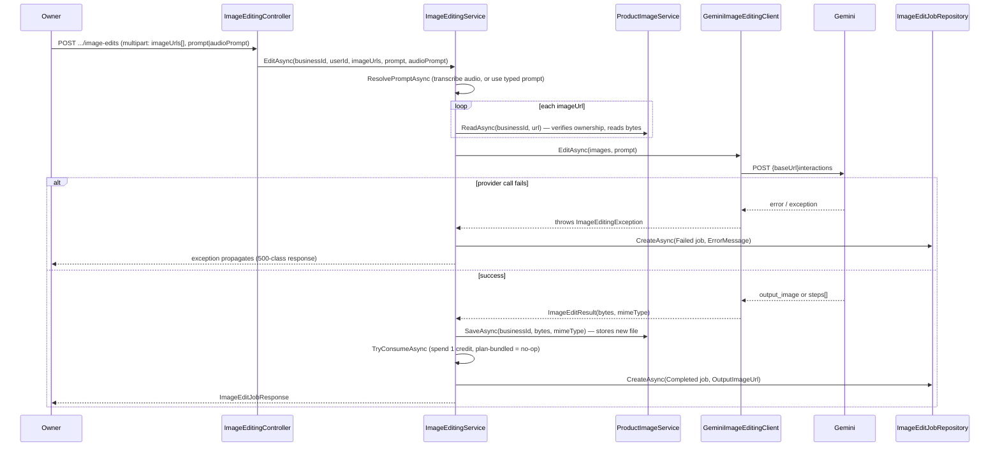

# AI Image Editing — End-to-End Pipeline

A business owner selects one or more of their product's already-uploaded photos and
describes an edit (typed or spoken); the backend sends the image(s) plus instruction
to Google's Gemini image model and stores the result as a new uploaded image. Unlike
[AI product creation](product-generation.md), this is single-shot: there is no
conversation to resume, no draft entity, and no multi-turn state. Each call either
succeeds and is recorded as a `Completed` job, or fails and is recorded as a `Failed`
job — nothing is left "in progress".

## Components involved

| Layer | Class | File |
|---|---|---|
| Controller | `ImageEditingController` | `Controllers/ImageEditingController.cs` |
| Orchestration service | `ImageEditingService` (`IImageEditingService`) | `Services/ImageEditing/ImageEditingService.cs` |
| AI provider boundary | `IProductImageEditingClient` → `GeminiImageEditingClient` | `Services/AI/Providers/GeminiImageEditingClient.cs` |
| Voice transcription | `IAiTranscriptionService` → `OpenAiTranscriptionService` (shared with product creation) | `Services/AI/Providers/OpenAiTranscriptionService.cs` |
| Image read/write | `IProductImageService` → `ProductImageService` | `Services/BusinessDashboard/ProductImageService.cs` |
| Job persistence | `IImageEditJobRepository` → `ImageEditJobRepository` | `Repositories/Implementations/ImageEditJobRepository.cs` |
| Entity | `ImageEditJob` | `Models/ImageEditJob.cs` |
| Credit metering | `IFeatureCreditService.TryConsumeAsync` | `Services/Subscription/FeatureCreditService.cs` |

## Authorization

`ImageEditingController` is routed under
`api/businesses/{businessId:guid}/dashboard/image-edits` with two class-level
policies, both required:

```csharp
[Authorize(Policy = AuthorizationPolicies.BusinessOwner)]
[Authorize(Policy = AuthorizationPolicies.AiImageEditing)]
```

Same authorization shape as AI product creation — `BusinessOwner` plus the
`Feature.AiImageEditing` policy, satisfied by plan bundling or a positive credit
balance. See [authentication.md](../authentication.md#feature-authorization).

## Data model: `ImageEditJob`

`Models/ImageEditJob.cs`. See [database.md](../database.md#imageeditjob) for the full
schema. Written exactly once per request, in its final state — there is no
intermediate "processing" row.

| Column | Type | Notes |
|---|---|---|
| `Id` | `Guid` | Also used as the reference recorded on the credit-spend transaction. |
| `BusinessId` | `Guid` | FK to `Business`. |
| `CreatedByUserId` | `Guid` | Recorded for audit only; authorization is by business membership, not this field. |
| `Prompt` | `string` | The resolved instruction — typed text, or the transcript if spoken. |
| `InputImageUrls` | `JsonDocument` | `["/uploads/...", ...]`, in the order sent to the model. A JSON array rather than a related table, since nothing about an input image is queried independently of its job. |
| `OutputImageUrl` | `string?` | Null until success; stays null on a `Failed` job. |
| `Status` | `ImageEditJobStatus` | `Completed` \| `Failed`. |
| `ErrorMessage` | `string?` | Set only on a `Failed` job; shown back to the owner. |

## Full pipeline: from request to stored output image



## Controller: `ImageEditingController`

Route: `api/businesses/{businessId:guid}/dashboard/image-edits`. Resolves
`CurrentUserId` from the JWT the same way `ProductDraftsController` does. Holds no AI
logic itself — it resolves the caller, delegates to the service, and returns.

| Endpoint | Description |
|---|---|
| `POST /` | `[RequestSizeLimit(26 * 1024 * 1024)]`. Multipart form: `imageUrls: List<string>` (URLs of images the owner already uploaded — **never raw file bytes for the images being edited**, only references to prior uploads), `prompt: string?` (typed instruction), `audioPrompt: IFormFile?` (spoken instruction). Exactly one of `prompt` / `audioPrompt` is expected. Returns `201 Created` (via `CreatedAtAction`) with the job. |
| `GET /{jobId}` | Returns the previously-created job, or `404` via `ImageEditJobNotFoundException` if it doesn't exist or belongs to another business. |

See [api/endpoints.md](../api/endpoints.md#imageeditingcontroller) for the full
route/status-code table.

## Method documentation — `ImageEditingService`

### `EditAsync(Guid businessId, Guid userId, List<string> imageUrls, string? prompt, IFormFile? audioPrompt, CancellationToken)`

**Purpose**: Runs one complete edit request against one or more of a business's own
uploaded images.

| Parameter | Type | Description |
|---|---|---|
| `businessId` | `Guid` | The business whose images are being edited (also the credit-metering scope). |
| `userId` | `Guid` | The requesting owner; recorded on the job for audit. |
| `imageUrls` | `List<string>` | URLs of already-uploaded images to edit together, in the order sent to the model. |
| `prompt` | `string?` | Typed instruction. Mutually exclusive in practice with `audioPrompt`. |
| `audioPrompt` | `IFormFile?` | Spoken instruction, transcribed before use. |

**Returns**: `Task<ImageEditJobResponse>` — the completed (or, via a thrown
exception, failed-and-recorded) job.

**Validation**:
- `imageUrls.Count == 0` → `InvalidImageEditRequestException("Select at least one
  image to edit.")`.
- `imageUrls.Count > MaxImages` (`MaxImages = 5`, chosen to match the cap manual
  product listings already use, and well inside the provider's own 14-image limit) →
  `InvalidImageEditRequestException("Select {MaxImages} images or fewer.")`.
- Prompt resolution failures (see `ResolvePromptAsync` below) also throw
  `InvalidImageEditRequestException`.

**Process**:
1. Validates the image count (above).
2. `ResolvePromptAsync` resolves the final instruction text.
3. For each URL in `imageUrls`, calls `IProductImageService.ReadAsync(businessId,
   url)` — this is what actually verifies the image belongs to this business; a URL
   is never trusted just because the frontend sent it, since these are URLs a prior
   upload returned to the client and the client could in principle send anything back.
   Each call returns raw bytes plus the stored content type, wrapped into an
   `ImageEditInput`.
4. Generates a `jobId` up front (needed either way, whether the call below succeeds or
   fails).
5. Calls `IProductImageEditingClient.EditAsync(inputs, resolvedPrompt)`.
   - **On exception**: immediately persists a `Failed` job (`BuildJob` with
     `outputUrl: null`, `error: ex.Message`) via `IImageEditJobRepository.CreateAsync`,
     then re-throws — the caller (the controller, then the global exception handler)
     is what ultimately turns this into an HTTP error response.
   - **On success**: continues to step 6.
6. Stores the returned bytes as a new image via
   `IProductImageService.SaveAsync(businessId, result.ImageBytes, result.MimeType)` —
   this runs the edited output through the same validated storage path as any other
   uploaded image.
7. Spends one credit via `IFeatureCreditService.TryConsumeAsync(businessId,
   FeatureKeys.AiImageEditing, jobId.ToString())`, **after** both the provider call and
   the save succeeded — same reasoning as the product-creation pipeline: the edit
   already happened, so the owner is never billed for one that produced nothing. A
   `false` result (exhausted in the narrow window since authorization was checked) is
   logged via `ILogger.LogWarning`, not turned into an error.
8. Builds and persists a `Completed` job with the new `OutputImageUrl`.
9. Returns the job mapped to `ImageEditJobResponse`.

**External services called**: `IProductImageEditingClient.EditAsync` (Gemini, via
`GeminiImageEditingClient`); `IAiTranscriptionService.TranscribeAsync` (OpenAI, only
if `audioPrompt` was supplied).

**DB operations**: exactly one insert into `ImageEditJobs`, either the `Failed` row
(step 5's catch branch) or the `Completed` row (step 8) — never both for the same
call.

### `GetAsync(Guid businessId, Guid jobId, CancellationToken)`

**Purpose**: Retrieves a previously created job.

**Process**: `IImageEditJobRepository.GetForBusinessAsync(businessId, jobId)` — scoped
to both ids together, so one business can never fetch another's job (the repository's
doc comment notes this deliberately returns the same "not found" outcome whether the
job doesn't exist or belongs elsewhere, so a caller can't distinguish the two and
probe for the existence of another business's job ids). Throws
`ImageEditJobNotFoundException` if `null`.

### `ResolvePromptAsync(string? prompt, IFormFile? audioPrompt, CancellationToken)` (private)

**Purpose**: Produces the single instruction string sent to the model, from whichever
input channel the request used.

**Process**:
1. If `audioPrompt` is provided: rejects an empty file with
   `InvalidImageEditRequestException("The voice message was empty.")`; opens its read
   stream and calls `IAiTranscriptionService.TranscribeAsync`; rejects a blank
   transcript with `InvalidImageEditRequestException("The voice message could not be
   understood.")`; otherwise returns the transcript.
2. Otherwise, if `prompt` is blank: throws `InvalidImageEditRequestException("Describe
   what you want changed.")`.
3. Otherwise returns `prompt` as-is.

### `BuildJob` / `ToResponse` (private static)

Plain mapping helpers. `BuildJob` sets `Status = Completed` when `error is null`, else
`Failed` — the single point that decides a job's terminal status.
`ToResponse` maps the entity to `ImageEditJobResponse`, unpacking `InputImageUrls`'s
JSON array back into a `List<string>`.

## Gemini request/response shape

Covered in full in [ai-services.md](ai-services.md#geminiimageeditingclient--iproductimageeditingclient);
summarized here for the pipeline context:

- **Request**: `POST {GeminiOptions.BaseUrl}interactions`, header `x-goog-api-key:
  <key>`, body `{ model: GeminiOptions.ImageEditingModel, input: [...images (base64),
  then one text part] }`.
- **Response**: the edited image is read from `output_image.data` /
  `output_image.mime_type` if present, otherwise found by scanning `steps[]` (last
  step first) for a content item with `type == "image"`.
- Sending multiple images in one call **fuses** them into a single combined output
  image, rather than editing each independently — this is why the frontend's
  multi-image "edit these together" UI issues one call per image when the owner wants
  each edited independently, and one call with all URLs when they want them combined
  (see the frontend's `useImageEditChat` hook, outside the scope of this backend
  documentation).

## Storage of the edited image

`IProductImageService.SaveAsync(businessId, byte[] bytes, string contentType,
CancellationToken)` — a second overload alongside the `IFormFile` overload used by
manual uploads, added specifically so AI-produced bytes that never came through a
form upload can go through the same validated storage path (byte-signature check,
allowed-type check). `contentType` is trusted from the caller here (rather than
re-derived), since the caller already knows what it asked the provider to return; the
byte-signature check still runs regardless. Full details in
[image-storage.md](../images/image-storage.md).

## Failure handling

| Failure point | What happens |
|---|---|
| No images selected, too many images, or no prompt/blank prompt | `InvalidImageEditRequestException` (Validation) thrown before any provider call — no job row is written at all. |
| Voice message empty or unintelligible | `InvalidImageEditRequestException` (Validation), no job row. |
| One of `imageUrls` doesn't belong to this business, or doesn't exist | `IProductImageService.ReadAsync` throws (an image-ownership/not-found exception — see [image-storage.md](../images/image-storage.md)); no job row, since this happens before the provider is called. |
| Gemini call fails (non-success status, unreadable response, no image in the response) | `ImageEditingException` (Unexpected) is thrown from `GeminiImageEditingClient`, caught by `ImageEditingService`, which **does** write a `Failed` job (with `ErrorMessage`) before re-throwing. |
| Credit exhausted after a successful edit | Not an error — logged only; the edited image is still saved and returned. |

The distinction above matters for anyone building on this API: a job row only exists
in the database once the provider has actually been contacted. Rejections that happen
before that point (bad request shape, an image the business doesn't own) are surfaced
purely as HTTP error responses with nothing persisted.

## Related documents

- [ai-services.md](ai-services.md) — the shared `IProductImageEditingClient` /
  `GeminiImageEditingClient` infrastructure this pipeline is built on.
- [product-generation.md](product-generation.md) — the sibling AI feature, sharing
  the credit-metering and fail-clean-provider patterns.
- [../images/image-storage.md](../images/image-storage.md) — `ProductImageService`,
  validation, and how stored files are served.
- [../database.md](../database.md#imageeditjob) — the `ImageEditJob` table schema.
- [../authentication.md](../authentication.md) — `BusinessOwner` and feature policies.
