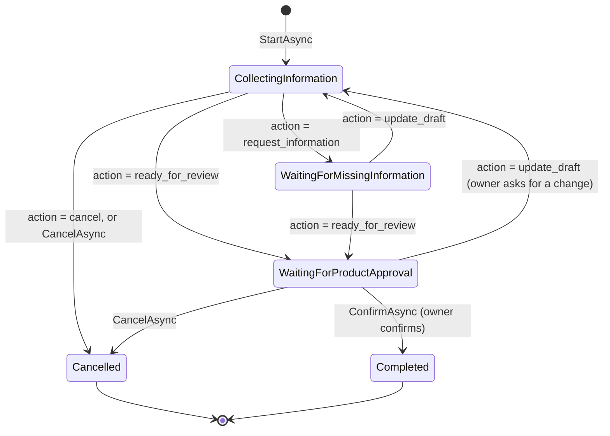
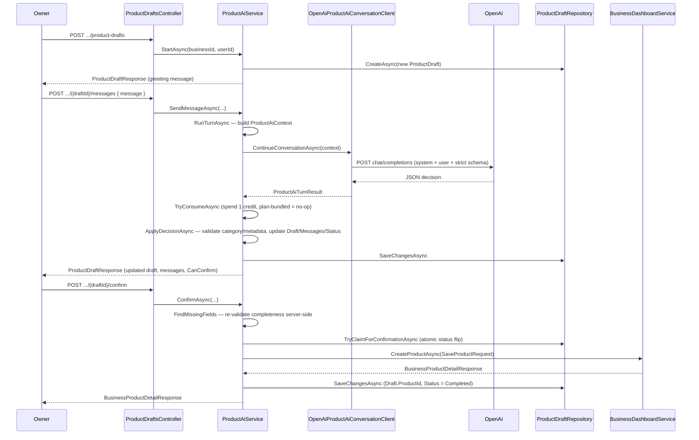

# AI Product Creation — End-to-End Pipeline

A business owner creates a product by chatting with an AI assistant instead of
filling out a form. The conversation is persisted as a `ProductDraft` row so it
survives page reloads and can be resumed; a product is written to the `products`
table only when the owner explicitly confirms.

## Components involved

| Layer | Class | File |
|---|---|---|
| Controller | `ProductDraftsController` | `Controllers/ProductDraftsController.cs` |
| Orchestration service | `ProductAiService` (`IProductAiService`) | `Services/ProductAi/ProductAiService.cs` |
| Draft state (de)serialization | `ProductDraftState` (static) | `Services/ProductAi/ProductDraftState.cs` |
| AI provider boundary | `IProductAiConversationClient` → `OpenAiProductAiConversationClient` | `Services/AI/Providers/OpenAiProductAiConversationClient.cs` |
| Prompt assembly | `OpenAiPromptBuilder` (internal) | `Services/AI/Providers/OpenAiPromptBuilder.cs` |
| Voice transcription | `IAiTranscriptionService` → `OpenAiTranscriptionService` | `Services/AI/Providers/OpenAiTranscriptionService.cs` |
| Draft persistence | `IProductDraftRepository` → `ProductDraftRepository` | `Repositories/Implementations/ProductDraftRepository.cs` |
| Entity | `ProductDraft` | `Models/ProductDraft.cs` |
| Metadata validation | `ProductMetadataBuilder` (static, shared with manual creation) | `Services/BusinessDashboard/ProductMetadataBuilder.cs` |
| Actual product creation | `IBusinessDashboardService.CreateProductAsync` | `Services/BusinessDashboard/BusinessDashboardService.cs` (see [product-management.md](../products/product-management.md)) |
| Credit metering | `IFeatureCreditService.TryConsumeAsync` | `Services/Subscription/FeatureCreditService.cs` |

## Authorization

`ProductDraftsController` is routed under
`api/businesses/{businessId:guid}/dashboard/product-drafts` and carries two
class-level policies, both of which must pass:

```csharp
[Authorize(Policy = AuthorizationPolicies.BusinessOwner)]
[Authorize(Policy = AuthorizationPolicies.AiProductGeneration)]
```

- `BusinessOwner` — the authenticated user must be the owner of the business named in
  the route.
- `Feature.AiProductGeneration` — the business must have the `ai.product_generation`
  feature, either via its subscription plan or a positive credit balance (see
  [ai/README.md](README.md#credit-metering) and
  [authentication.md](../authentication.md#feature-authorization)).

Because `businessId` is authorization-checked from the route before any handler runs,
it is never "trusted input from the client" inside the service — every draft lookup
is still re-scoped to it in the repository as a second, independent guard.

## Data model: `ProductDraft`

`Models/ProductDraft.cs`. See [database.md](../database.md#productdraft) for the full
column/FK reference. The fields most relevant to this pipeline:

- `Status` (`ProductDraftStatus` enum) — drives what the UI is allowed to do next.
- `Draft` (`JsonDocument?`) — the structured product state the AI reads and writes
  each turn, in the shape of `ProductAiDraft`.
- `Messages` (`JsonDocument?`) — the conversation transcript, in MerchForge's own
  shape (`{ "messages": [{ role, text, kind, at }] }`), not a raw provider object —
  chosen so the record stays readable and survives a provider swap.
- `OriginalImageUrl` / `ProcessedImageUrl` / `ImageModificationPrompt` — see
  [Image handling within the conversation](#image-handling-within-the-conversation)
  below.
- `ProductId` (`Guid?`) — set once confirmed; also the guard against confirming twice.

### `ProductDraftStatus` lifecycle



Two enum values, `ProcessingImage` and `WaitingForImageApproval`, exist on
`ProductDraftStatus` and are **checked against** in `ProductAiService`
(`EnsureConversationOpen`, `ConfirmAsync`, `ResolveImageModificationAsync`,
`BuildResponseAsync`'s `CanConfirm` computation) but are never actually **assigned**
anywhere in the current codebase. `AttachImageAsync` — the method whose name suggests
it would drive this state — instead sends the attached image straight back into the
normal `RunTurnAsync` conversation turn without setting `ProcessingImage` or
`WaitingForImageApproval`. In the currently deployed code, these two statuses and
`ResolveImageModificationAsync` are unreachable through any exposed endpoint; the
actual AI-assisted photo editing feature ships instead as the separate, non-chat
[image-editing pipeline](image-editing.md). This could not be resolved further from
the implementation — it reads as infrastructure reserved for a future in-conversation
image-approval flow that has not been wired up yet.

## Full pipeline: from request to persisted product



## Controller: `ProductDraftsController`

Route: `api/businesses/{businessId:guid}/dashboard/product-drafts`. Every action
resolves `CurrentUserId` from the JWT's `ClaimTypes.NameIdentifier` claim (never from
the request body, so it can't be spoofed) and otherwise just delegates to
`IProductAiService` and returns its result. See
[api/endpoints.md](../api/endpoints.md#productdraftscontroller) for the full
route/verb/status-code table.

| Endpoint | Service call |
|---|---|
| `POST /` | `StartAsync` |
| `GET /{draftId}` | `GetAsync` |
| `POST /{draftId}/messages` | validates `SendDraftMessageRequest` via FluentValidation, then `SendMessageAsync` |
| `POST /{draftId}/voice` | `SendVoiceMessageAsync` (multipart `IFormFile`, max 26 MB) |
| `POST /{draftId}/image` | `AttachImageAsync` (multipart `IFormFile`, max 6 MB) |
| `POST /{draftId}/image-approval` | `ResolveImageModificationAsync` (currently unreachable in practice — see above) |
| `POST /{draftId}/confirm` | `ConfirmAsync` — the only action that writes to `products` |
| `POST /{draftId}/cancel` | `CancelAsync` |

`SendDraftMessageRequest.Message` is validated by
`Validators/ProductAi/SendDraftMessageRequestValidator.cs`: non-empty, max length
2000 characters (bounded before it reaches the provider — an unbounded message is
billed by the token and gains nothing over a long-but-sane one).

## Method documentation — `ProductAiService`

### `StartAsync(Guid businessId, Guid userId, CancellationToken)`

**Purpose**: Begins a new AI product-creation conversation.

| Parameter | Type | Description |
|---|---|---|
| `businessId` | `Guid` | The business the product will belong to. |
| `userId` | `Guid` | The authenticated owner starting the conversation; recorded on the draft for audit only — resuming a draft is authorized by business membership, not by this field. |

**Returns**: `Task<ProductDraftResponse>` — the new draft, containing one assistant
greeting message and no product state yet.

**Process**:
1. Calls `IBusinessDashboardService.GetProductFormAsync(businessId)` — this both
   confirms the business exists and supplies the categories/metadata-field
   configuration needed for the greeting text.
2. Creates a new `ProductDraft` with `Status = CollectingInformation`.
3. Writes a static, non-AI-generated greeting via `BuildGreeting(form)` — the opening
   message is always the same for a given business's field configuration, so paying
   for a model call to produce it would be pure waste.
4. Persists the draft via `IProductDraftRepository.CreateAsync`.
5. Builds and returns the response via `BuildResponseAsync`.

**External services called**: none (no AI call on start).
**DB operations**: one insert (`ProductDrafts`).

### `SendMessageAsync` / `SendVoiceMessageAsync`

**Purpose**: Continues an existing conversation with a typed or spoken message.

`SendVoiceMessageAsync` additionally: rejects an empty `IFormFile` with
`AiConversationException("The voice message was empty.")`; opens the file's read
stream and calls `IAiTranscriptionService.TranscribeAsync`; rejects a blank/failed
transcript with `AiConversationException("The voice message could not be
understood.")`. The orchestration then proceeds identically to a typed message —
`RunTurnAsync` receives plain text either way and does not know voice was involved.

Both call `EnsureConversationOpen(draft)` first, which throws
`ProductDraftStateException` if the draft's status is `Completed`, `Cancelled`,
`Failed`, or `WaitingForImageApproval`.

### `AttachImageAsync(Guid businessId, Guid userId, Guid draftId, IFormFile image, CancellationToken)`

**Purpose**: Attaches a product photo to the draft.

**Process**:
1. `EnsureConversationOpen`.
2. Saves the image via `IProductImageService.SaveAsync(businessId, image, ct)` — the
   same validated upload path (signature check, size limit, allowed types) used by
   manual product creation, so an AI-flow image gets identical checking.
3. Sets `draft.OriginalImageUrl` to the new URL; clears any in-flight
   `ProcessedImageUrl` / `ImageModificationPrompt` — a newly attached image discards
   whatever edit was previously pending.
4. Runs a conversation turn with the synthetic message `"[The owner attached a
   product image.]"`, so the agent is told an image arrived and can stop asking for
   one — the agent itself never sees the image bytes or URL.

### `ResolveImageModificationAsync(Guid businessId, Guid userId, Guid draftId, bool approved, CancellationToken)`

**Purpose**: Accepts or rejects a pending AI image edit. Throws
`ProductDraftStateException("There is no image waiting for approval.")` unless
`Status == WaitingForImageApproval` — a status this codebase currently never
assigns, so this method is not reachable via any wired-up flow today (see the
lifecycle note above). Documented for completeness since the endpoint exists and is
routed.

### `ConfirmAsync(Guid businessId, Guid userId, Guid draftId, CancellationToken)`

**Purpose**: Turns a completed draft into a real product. The only method in the
service that writes to the `products` table, and reachable only by explicit owner
action — the agent deciding a product "looks done" only ever moves the draft to
`WaitingForProductApproval`, never further.

**Process**:
1. Rejects with `ProductDraftStateException` if the draft is already `Completed`
   (guards a double click / stale tab / retried request from creating two products),
   or if it's `Cancelled`/`Failed`.
2. Rejects if `Status` is `WaitingForImageApproval` or `ProcessingImage` — an
   unresolved image edit blocks creation. (The UI is expected to hide the confirm
   button via `CanConfirm` already, but this endpoint is independently reachable, so
   the rule is enforced again here.)
3. Re-validates completeness server-side via `FindMissingFields` — never trusts the
   agent's `ReadyForReview` decision, since the `products` table is what's being
   written. Throws `ProductDraftStateException` naming the specific missing fields if
   incomplete.
4. Builds a `SaveProductRequest` from the draft's structured state — title,
   description, price, compare-at price, category, sku, stock, tags, sale end date,
   a single main image (`IsMain = true`) from `OriginalImageUrl`, and metadata.
5. Calls `IProductDraftRepository.TryClaimForConfirmationAsync(businessId, draftId)`
   — an atomic, single-statement `UPDATE ... WHERE Status NOT IN (Completed,
   Cancelled, Failed)` (via EF Core's `ExecuteUpdateAsync`) that flips the draft to
   `Completed` **before** the product is created. This — not the status checks above
   — is what makes concurrent confirmations mutually exclusive: two requests racing
   past the earlier checks would otherwise both see a non-terminal status and both
   create a product. Throws `ProductDraftStateException` if the claim fails (lost the
   race).
6. Calls `IBusinessDashboardService.CreateProductAsync` — deliberately the same
   method manual product creation uses, so category-usability and metadata-typing
   validation apply identically regardless of how a product was authored.
7. If step 6 throws, calls `IProductDraftRepository.ReleaseConfirmationClaimAsync`
   to put the draft back to `WaitingForProductApproval` and re-throws — otherwise a
   rejection at this last step (e.g. an unusable category) would strand the draft as
   `Completed` with no product and no way to retry.
8. On success, sets `draft.ProductId` and persists.

**Returns**: `Task<BusinessProductDetailResponse>` — the newly created product, in
the same shape `BusinessDashboardController`'s product endpoints return.

**Exceptions**: `ProductDraftStateException` (Conflict) for any of the state checks
above; whatever `CreateProductAsync` itself can throw (see
[product-management.md](../products/product-management.md)) propagates after the
claim is released.

### `CancelAsync(Guid businessId, Guid userId, Guid draftId, CancellationToken)`

**Purpose**: Abandons a draft. Throws `ProductDraftStateException` if already
`Completed`; otherwise sets `Status = Cancelled` and persists.

### `RunTurnAsync` (private) — the core of one conversation turn

Called by every message-producing public method (`SendMessageAsync`,
`SendVoiceMessageAsync`, `AttachImageAsync`).

**Process**:
1. Loads the current `ProductFormResponse` (categories + metadata fields) and the
   business's display name.
2. Appends the incoming message to `draft.Messages` via `ProductDraftState.AppendMessage`.
3. Builds a `ProductAiContext`: `BusinessName`, `Currency` (hardcoded `"USD"` at this
   call site — see [Known limitations](#known-limitations-and-unresolved-behavior)),
   `Categories`, `MetadataFields`, `CurrentDraft` (read from `draft.Draft` via
   `ProductDraftState.ReadDraft`), `History` (the last `PromptHistoryLimit` = 12
   messages **excluding** the one just appended — the just-appended message is passed
   separately as `LatestUserMessage` so the agent can distinguish "what was said
   before" from "what to respond to now"), and `LatestUserMessage`.
4. Logs `LogTurnStarted`, starts a `Stopwatch`.
5. Calls `IProductAiConversationClient.ContinueConversationAsync(context)`.
   - **On failure**: logs `LogTurnFailed`, persists the already-appended user message
     (so the conversation stays resumable — the draft is *not* marked `Failed* for a
     transient provider error, which would otherwise strand a recoverable
     conversation), and throws `AiConversationException("The assistant is
     unavailable right now. Please try again.", innerException)`.
   - **On success**: logs `LogTurnSucceeded` with the decision's action, missing-field
     count, elapsed time, and token counts.
6. Spends one credit via `IFeatureCreditService.TryConsumeAsync(draft.BusinessId,
   FeatureKeys.AiProductGeneration, draft.Id.ToString())`, **after** the provider call
   succeeded — never before, so a failed call is never billed. A `false` result
   (credits exhausted in the narrow window since the endpoint's own authorization
   check) is logged via `LogValidationRejected(scope, "ai_credits_exhausted")` rather
   than turned into an error — the model call already happened and the owner already
   has a usable reply, so failing the request at this point would be worse than
   letting the balance floor at zero and catching it on the next turn.
7. Calls `ApplyDecisionAsync` to validate and merge the decision into the draft.
8. Updates `LastMessageAt` / `UpdatedAt`, persists via
   `IProductDraftRepository.SaveChangesAsync`.
9. Returns via `BuildResponseAsync`.

### `ApplyDecisionAsync` (private) — validating and merging a decision

**Process**:
1. Loads `formData` (`MetadataShape` + category list) via
   `IBusinessDashboardRepository.GetProductFormDataAsync`.
2. If the decision carries a `Draft`:
   - **Category re-validation**: if `CategoryId` is set, calls
     `IBusinessDashboardRepository.CanUseCategoryAsync(businessId, categoryId)`. If
     not usable, logs `LogValidationRejected(scope, "category_not_usable")` and clears
     `CategoryId` — the model picks from a list the backend supplied, so anything else
     is treated as a hallucination and dropped rather than carried forward to fail
     confusingly at confirmation time.
   - **Metadata re-validation**: `StripDisallowedMetadata` (see below) removes any
     metadata value outside its field's allowed set, returning a list of
     human-readable rejection messages.
   - Writes the (possibly trimmed) draft state back via
     `ProductDraftState.WriteDraft`.
3. Appends the decision's `Message` as an assistant message — or `"Got it."` if the
   model returned a blank message (the schema requires the field but doesn't
   guarantee it's non-empty in practice; a silent assistant reply would read as a
   broken chat).
4. Appends one additional assistant message per rejected metadata value, so the
   owner is told explicitly what wasn't accepted and why, rather than having it
   silently vanish.
5. Maps `decision.Action` to the draft's new `Status`:

| `ProductAiAction` | New `Status` |
|---|---|
| `ReadyForReview` | `WaitingForProductApproval` |
| `Cancel` | `Cancelled` |
| `RequestInformation` | `WaitingForMissingInformation` |
| `UpdateDraft` (default) | `CollectingInformation` |

### `StripDisallowedMetadata` (private static)

**Purpose**: A second, independent guard against the model returning a metadata
value the business doesn't actually permit — beyond what the system prompt already
instructs it to avoid.

**Process**: For each metadata key present in the state, looks up its `FieldRule` via
`ProductMetadataBuilder.ReadShape(metadataShape)`. Determines an `isAllowed`
predicate: if the field declares `AllowedValues`, membership in that list
(case-insensitive); else, if the field's `ValueType` is `ColorList`, a hex-color
regex match (`^#[0-9A-Fa-f]{6}$`); else no check is applied (free-form fields have
nothing to reject). Offending string or array-of-string values are removed — array
values keep whatever entries *did* pass, dropping only the bad ones; a wholly-invalid
single string value removes the key entirely. One rejection message is generated per
affected key, naming what was rejected and either the allowed list or the "must be
hex codes" hint.

**Why removal, not turn rejection**: the doc comment explains this is deliberate — the
rest of what the owner said in that message is still good, and discarding all of it
because one value was invalid would be worse than asking again about just that one
field. It also prevents `ProductMetadataBuilder` (called later, at confirmation) from
throwing a hard validation exception on a bad `ColorList` value — that would surface
as an unhandled failure instead of a normal chat message.

### `FindMissingFields` (internal static)

**Purpose**: The single source of truth for whether a draft can be confirmed —
independent of, and re-checked separately from, the agent's own `MissingFields`
opinion.

**Parameters**: `state: ProductAiDraft?`, `hasImage: bool`, `metadataShape:
JsonDocument?`.

**Returns**: `List<string>` — empty means ready. Checks, in order: `title` (blank →
missing), `price` (null → missing), `category` (`CategoryId` null → missing), `image`
(no image attached → missing — a listing without a picture is never something an
owner would want published, so the assistant is instructed to ask for one before
offering review), then every **required** metadata field from the business's
configured shape (`metadata.{key}` — checked for null/undefined, an empty array, or a
blank string; an empty list "satisfies nothing", per the code comment).

Called from both `ConfirmAsync` (hard gate before writing to `products`) and
`BuildResponseAsync` (to compute the response's advisory `MissingFields` and
`CanConfirm`), guaranteeing the two never disagree.

### `BuildResponseAsync` (private)

**Purpose**: Assembles the `ProductDraftResponse` DTO returned by every endpoint.

**Process**: Reads the current `ProductAiDraft` state; resolves the category's
display name (from a supplied or freshly-fetched `ProductFormResponse`); recomputes
`FindMissingFields` from the backend's own metadata shape (**never** the agent's
`MissingFields` — the code comment explains the agent's list was found to be
inconsistent in practice: it named fields differently, e.g. `"colors"` vs. the
backend's `"metadata.colors"`, and could omit a field the model itself had
overlooked); sets `CanConfirm = (no missing fields) && Status not in {Completed,
Cancelled, Failed, WaitingForImageApproval}`.

## `ProductDraftState` — draft persistence helpers

Static class, kept separate from the orchestration precisely so the stored JSON
shape is defined in exactly one place.

| Method | Purpose |
|---|---|
| `ReadDraft(ProductDraft)` → `ProductAiDraft?` | Deserializes `draft.Draft`. A malformed document is treated as `null` (empty draft) rather than throwing — the conversation continues and the agent rebuilds state from the still-intact message history, rather than crashing. |
| `WriteDraft(ProductDraft, ProductAiDraft?)` | Serializes (camelCase, nulls omitted) back onto `draft.Draft`. |
| `ReadMessages(ProductDraft)` → `List<StoredMessage>` | Deserializes `draft.Messages`; empty list on missing/malformed data. |
| `AppendMessage(ProductDraft, role, text, kind)` | Reads, appends a `StoredMessage { Role, Text, Kind, At = UtcNow }`, re-serializes. |
| `ToPromptHistory(ProductDraft, maxMessages)` → `List<ProductAiMessage>` | The last `maxMessages` stored messages, mapped down to `{ Role, Text }` for the prompt. Capped deliberately — the structured draft already carries accumulated state, so unbounded history would only grow cost/latency for context the agent rarely needs; recent turns are what disambiguate a reply like "the second one". |

## Choosing an action

From the system prompt (`OpenAiPromptBuilder.BuildSystemInstructions`), the model is
instructed to pick exactly one action per turn:

- **`request_information`** — something required is missing or ambiguous; ask for it
  in `message`.
- **`update_draft`** — information was recorded; the conversation continues.
- **`ready_for_review`** — title, price, and category are all set (description too,
  if enough was said to write one). This only *proposes* the product for review; it
  must never claim the product has been created or saved, since the owner still has
  to confirm separately.
- **`cancel`** — the owner clearly wants to abandon the draft.

## Image handling within the conversation

Two independent image mechanisms exist in the codebase and should not be confused:

1. **Attaching the product's photo** (`AttachImageAsync`, documented above) — fully
   wired, sets `OriginalImageUrl`, used at confirmation.
2. **AI-editing that photo from within the chat** — represented by
   `ProcessedImageUrl`, `ImageModificationPrompt`, the `ProcessingImage` /
   `WaitingForImageApproval` statuses, and `ResolveImageModificationAsync` — present
   in the data model and service but not reachable through any code path that sets
   those statuses. The behavior a fully wired version of this would have could not be
   determined from the current implementation. The actual, shipped way to AI-edit a
   product photo is the separate [image-editing pipeline](image-editing.md), which
   has no conversational state at all.

## Error handling summary

| Condition | Exception | `ErrorType` |
|---|---|---|
| Draft doesn't exist / belongs to another business | `ProductDraftNotFoundException` | `NotFound` |
| Action invalid for the draft's current status (already completed, cancelled, unresolved image approval, etc.) | `ProductDraftStateException` | `Conflict` |
| AI provider call failed or returned an unparseable decision | `AiConversationException` | `Unexpected` |
| Empty or unintelligible voice message | `AiConversationException` | `Unexpected` |
| `Message` empty or over 2000 characters | FluentValidation failure (`SendDraftMessageRequestValidator`) | `Validation` |

See [error-handling.md](../error-handling.md) for how these enum values map to HTTP
status codes.

## Known limitations and unresolved behavior

- `Currency` is hardcoded to `"USD"` in `RunTurnAsync` regardless of the business's
  actual configured currency. Whether the business entity carries a currency setting
  at all, and whether this is intentional or a gap, could not be determined from
  `ProductAiService.cs` alone.
- The in-conversation image-approval flow (`ProcessingImage`,
  `WaitingForImageApproval`, `ResolveImageModificationAsync`) is present but
  unreachable, as detailed above.
- `Provider` / `ConversationId` on `ProductDraft` are populated nowhere in the read
  code — they are documented on the entity as reserved for a future non-dashboard
  ingestion channel (e.g. Telegram/WhatsApp) but no such channel exists yet in this
  codebase.

## Related documents

- [ai-services.md](ai-services.md) — the shared AI provider infrastructure this
  pipeline depends on.
- [image-editing.md](image-editing.md) — the separate, shipped AI photo-editing
  feature.
- [../products/product-management.md](../products/product-management.md) —
  `CreateProductAsync`, which `ConfirmAsync` delegates to.
- [../database.md](../database.md#productdraft) — the `ProductDraft` table schema.
- [../authentication.md](../authentication.md) — `BusinessOwner` and feature policies.
