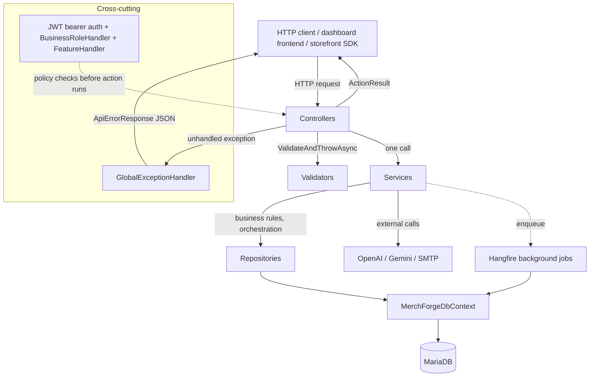

# Architecture

MerchForge's backend (`MerchForge.api`) is a single ASP.NET Core Web API project
(.NET 10) following a conventional layered architecture: **Controllers** →
**Services** (business logic) → **Repositories** (data access) → **EF Core /
MariaDB**, with **DTOs** as the boundary shape and **Validators**,
**Authorization handlers**, and a **global exception handler** as cross-cutting
concerns. There is no separate application/domain project split — everything lives
in one project, organized by folder.

## Layer responsibilities (as observed in the code)

| Layer | Folder | Responsibility |
|---|---|---|
| **Controllers** | `Controllers/` | Thin HTTP adapters. Resolve the authenticated caller (`ClaimTypes.NameIdentifier`), run FluentValidation on the request DTO where applicable, call exactly one service method, map the result to an `ActionResult`. No business logic — every controller inspected in this pass (`AuthController`, `BusinessDashboardController`, `ProductDraftsController`, `ImageEditingController`, `FeaturesController`, `DashboardController`, `DomainsController`, `StorefrontController`, `InvitationController`) follows this shape without exception. |
| **Services** | `Services/{Area}/` | All business logic: orchestration, validation beyond simple field checks, calls to other services/repositories, external API calls. Each area (`Auth`, `BusinessDashboard`, `Dashboard`, `ProductAi`, `ImageEditing`, `Subscription`, `Invitation`, `Onboarding`, `Storefront`, `Email`, `AI`, `Common`) exposes an interface (`I{Name}Service`) registered as `Scoped` in `Program.cs`, with one concrete implementation. |
| **Repositories** | `Repositories/{Interfaces,Implementations}` | The only layer that talks to `MerchForgeDbContext` directly for the entities each repository owns. One repository per aggregate root (`IUserRepository`, `IBusinessRepository`, `IProductDraftRepository`, `IFeatureCreditRepository`, etc.), each scoped to the business/owner context on every query (see the repeated "both predicates together" pattern documented throughout this doc set). A few services (`InvitationService`, `BusinessRoleHandler`, the Hangfire jobs) query `MerchForgeDbContext` directly instead of going through a repository — this is an observed inconsistency, not a documented rule; both patterns coexist in the current codebase. |
| **Entities** | `Models/` | Plain EF Core entity classes — no behavior, only data and navigation properties. Every table-mapping concern (constraints, indexes, conversions, seed data) lives in a matching `Configurations/*Configuration.cs` class, not on the entity itself. |
| **DTOs** | `DTOs/{Area}/` | Request/response shapes, one folder per area, mirroring the `Services/` areas. Never the same type as an entity — every controller/service boundary crossing goes through an explicit DTO, even where the shape is nearly identical to the entity (e.g. `ProductDraftResponse` vs. `ProductDraft`). |
| **Validators** | `Validators/{Area}/` | FluentValidation `AbstractValidator<T>` classes, one per request DTO that needs field-level validation beyond what model binding provides. Registered in bulk via `AddValidatorsFromAssemblyContaining<Program>()`. Invoked explicitly in controller actions via `IValidator<T>.ValidateAndThrowAsync(...)` — validation is **not** automatic middleware; each action opts in. |
| **Authorization** | `Authorization/` | Two custom `IAuthorizationHandler` implementations (`BusinessRoleHandler`, `FeatureHandler`) plus their `IAuthorizationRequirement` types, registered as ASP.NET Core policies in `Program.cs`. See [authentication.md](authentication.md). |
| **Exception handling** | `Exceptions/` | One base class (`AppException`), one `IExceptionHandler` implementation (`GlobalExceptionHandler`), and per-area subfolders of named exception subclasses. See [error-handling.md](error-handling.md). |
| **Database layer** | `Data/`, `Configurations/`, `Migrations/` | `MerchForgeDbContext` (one per-request `DbContext`, no repository-of-repositories or unit-of-work abstraction beyond what EF Core itself provides), entity configurations, and EF Core migrations. See [database.md](database.md). |
| **External integrations** | `Services/AI/Providers/`, `Services/Email/` | Every external HTTP/SMTP call is isolated behind an interface with exactly one production implementation per provider — see [External integrations](#external-integrations) below. |
| **AI services** | `Services/AI/`, `Services/ProductAi/`, `Services/ImageEditing/` | See [ai/README.md](ai/README.md) for the full breakdown; summarized in the [dependency-flow diagram](#dependency-flow) below. |
| **Background jobs** | `Jobs/Email/` | Hangfire-executed jobs, invoked via `IBackgroundJobClient.Enqueue<TJob>(...)` from services — see [Background jobs](#background-jobs-hangfire) below. |

## Dependency flow



Every arrow reflects an actual call chain found in the code, not an idealized
layering — see the exceptions noted in the Repositories row above.

## Registration pattern in `Program.cs`

Services and repositories are registered individually as `Scoped`
(`builder.Services.AddScoped<IFoo, Foo>()`) — no assembly scanning for DI
registration (FluentValidation is the one exception, using
`AddValidatorsFromAssemblyContaining<Program>()`). Grouped by comment banner in the
file, in this order: options binding, validation, controllers + JSON options, DB
context, Hangfire, CORS, Swagger, Auth services, Subscription services, Dashboard
services, Storefront services, Onboarding services, **AI product creation**
(with the fail-clean conditional registration — see below), **AI image editing**
(same pattern), Authorization services + policies, global exception handler,
Invitation services, Email services, then every repository.

### The fail-clean conditional-provider pattern

Both AI features (and only the AI features) use this pattern in `Program.cs`:

```csharp
if (aiOptions.IsConfigured)
{
    builder.Services.AddHttpClient<IProductAiConversationClient, OpenAiProductAiConversationClient>();
    builder.Services.AddHttpClient<IAiTranscriptionService, OpenAiTranscriptionService>();
}
else
{
    builder.Services.AddScoped<IProductAiConversationClient, UnavailableProductAiConversationClient>();
    builder.Services.AddScoped<IAiTranscriptionService, UnavailableAiTranscriptionService>();
}
```

`AiOptions.IsConfigured` / `GeminiOptions.IsConfigured` are evaluated once, at
startup, from configuration already bound at that point (`builder.Configuration
.GetSection(...).Get<T>()`, read a second time outside the `AddOptions<T>()` binding
specifically so the value is available immediately for this branch rather than only
through DI). No other area of the codebase uses a runtime-conditional DI
registration — every other service has exactly one registered implementation. Full
detail: [ai/ai-services.md](ai/ai-services.md#fail-clean-provider-registration).

## Service catalog

Every service interface found under `Services/`, grouped by area, with a one-line
purpose. Areas already documented in full elsewhere in this set are linked rather
than repeated.

| Area | Interface | Purpose |
|---|---|---|
| **Auth** | `IAuthService`, `IJwtService`, `IRefreshTokenService` | See [authentication.md](authentication.md). |
| **AI** (shared) | `IProductAiConversationClient`, `IAiTranscriptionService`, `IProductImageEditingClient`, `IAiInteractionLogger` | See [ai/ai-services.md](ai/ai-services.md). |
| **ProductAi** | `IProductAiService` | See [ai/product-generation.md](ai/product-generation.md). |
| **ImageEditing** | `IImageEditingService` | See [ai/image-editing.md](ai/image-editing.md). |
| **BusinessDashboard** | `IBusinessDashboardService` | Product CRUD, dashboard stats, website-template selection for one business. See [products/product-management.md](products/product-management.md). |
| **BusinessDashboard** | `IBusinessMemberService` | Creates team-member accounts (`Admin`/`Member` roles only — never `Owner`) attached to a business. Kept separate from `IBusinessDashboardService`, per its own doc comment, because creating an account is an identity concern (password hashing, role lookups) while the dashboard service only reads and aggregates. |
| **BusinessDashboard** | `IProductImageService` | See [images/image-storage.md](images/image-storage.md). |
| **Subscription** | `ISubscriptionService`, `IFeatureCreditService` | Plan-membership checks and independent feature-credit purchase/consumption. See [authentication.md](authentication.md#3-feature-access--featurehandler--featurerequirement) and [database.md](database.md#feature-credits-independent-of-plans). |
| **Invitation** | `IInvitationService` | Issues and validates single-use business-owner invitations. See [authentication.md](authentication.md#invitations). |
| **Onboarding** | `IDomainService` | Read-only domain/category/product-attribute reference data for the registration form, plus the two "build but don't persist yet" helpers (`BuildCustomCategoriesAsync`, `BuildMetadataShapeAsync`) that `AuthService.CompleteBusinessOwnerRegistration` calls before creating a business. Backs `DomainsController`. |
| **Storefront** | `IStorefrontService` | Public, anonymous, read-only catalog queries (business info, categories, products, related products) consumed by independently-deployed storefronts through the MerchForge Storefront SDK. Every method is explicitly documented (in its own interface's doc comment) to take `businessId` as a plain `Guid` rather than resolving it from ambient request state, so a future hostname-based resolution strategy only has to change the controller. Backs `StorefrontController`. |
| **Dashboard** | `IDashboardService` | Platform-wide (cross-business) admin operations: global stats, paged user/business listings, forcibly revoking a user's sessions (all their refresh tokens), and managing the `WebsiteTemplate` catalogue. Gated entirely behind `SystemSuperAdmin`. Backs `DashboardController`. |
| **Email** | `IEmailService` | Sends two specific transactional emails via MailKit/SMTP: the business-owner invitation, and an admin notification when a business chooses a website template. Both build their HTML bodies from inline C# raw string literals (no separate templating engine or `.cshtml`/`.html` template files). Any SMTP failure is wrapped as `EmailDeliveryException` (`ErrorType.Unexpected`) after logging the underlying exception — the raw SMTP error is never exposed to a caller. |
| **Common** | `TimeSeriesBuilder`, `Slug`, `PasswordGenerator` (static helpers, no interfaces) | `TimeSeriesBuilder.BuildMonthlySeries` — fills gaps in a date range so a stats chart never has to handle a missing month client-side. `Slug` — url-safe slug generation. `PasswordGenerator.Generate()` — produces the random passwords used for both business-owner and team-member account creation (see [authentication.md](authentication.md#completebusinessownerregistrationcompletebusinessownerregistrationrequest-cancellationtoken)). |

## Background jobs (Hangfire)

MerchForge uses Hangfire (`Hangfire.AspNetCore` + `Hangfire.MySqlStorage`) for
fire-and-forget work triggered from request-handling code, storing its job queue in
the **same** MariaDB database as the application (`AddHangfire(cfg =>
cfg.UseStorage(new MySqlStorage(connectionString, ...)))` in `Program.cs`). The
Hangfire dashboard is mounted at the default route in Development
(`app.UseHangfireDashboard()`, gated by `if (app.Environment.IsDevelopment())` — no
separate authorization check on the dashboard route itself was found, meaning it is
only reachable at all because it's compiled out of non-Development environments).

Two jobs exist, both under `Jobs/Email/`, both decorated `[AutomaticRetry(Attempts =
3)]`:

- **`SendBusinessOwnerInvitationJob`** — enqueued by `InvitationService` after an
  invitation row is committed. Re-checks the invitation's current state (not
  revoked, not accepted, not expired) before sending, since Hangfire's retry could
  otherwise fire after the invitation was invalidated by unrelated activity; records
  `EmailSentAt` on success or `EmailDeliveryFailedAt`/`EmailDeliveryError` on
  failure, then re-throws so Hangfire's own retry/failure tracking still applies.
- **`NotifyAdminOfWebsiteTemplateChoiceJob`** — enqueued by
  `BusinessDashboardService.ChooseWebsiteTemplateAsync` after a template choice
  commits. Notifies every `SuperAdmin` individually; one admin's delivery failure is
  caught and logged per-recipient rather than allowed to abort the loop or trigger a
  Hangfire-level retry that would re-notify admins who already received it
  successfully — a deliberate divergence from the invitation job's "let it throw and
  retry" strategy, justified by the different failure semantics (one recipient
  failing vs. the single recipient of the invitation).

Both jobs query `MerchForgeDbContext` directly rather than through a repository —
consistent with the earlier note that repository usage is not enforced uniformly
across the codebase.

## External integrations

| Integration | Interface | Implementation | Purpose |
|---|---|---|---|
| OpenAI Chat Completions | `IProductAiConversationClient` | `OpenAiProductAiConversationClient` | AI product-creation conversation turns. |
| OpenAI Transcription | `IAiTranscriptionService` | `OpenAiTranscriptionService` | Voice-message-to-text for both AI features. |
| Google Gemini Interactions API | `IProductImageEditingClient` | `GeminiImageEditingClient` | AI image editing. |
| SMTP (via MailKit/MimeKit) | `IEmailService` | `EmailService` | Invitation and admin-notification emails. |

Every one of these follows the same shape: a narrow interface, exactly one
production implementation that is the *only* class in the codebase aware of that
specific provider's request/response format, and (for the two AI providers) an
`Unavailable*` fallback registered when no credential is configured. See
[ai/ai-services.md](ai/ai-services.md) for the AI providers in full detail.

## Cross-cutting middleware order (`Program.cs`)

```
UseHangfireDashboard (Development only) → UseSwagger/UseSwaggerUI (Development only)
→ UseExceptionHandler → UseHttpsRedirection → UseCors("Frontend")
→ UseStaticFiles (uploaded product images) → UseAuthentication → UseAuthorization
→ MapControllers
```

`UseExceptionHandler` is registered early — before HTTPS redirection, CORS, static
files, or auth — so it can catch exceptions thrown by any later middleware or by a
controller action. `UseCors("Frontend")` runs once, globally; `StorefrontController`'s
separate `"Storefront"` policy is applied per-controller via `[EnableCors("Storefront")]`,
overriding the global policy just for that controller rather than requiring a second
`app.UseCors(...)` call.

## Related documents

- [database.md](database.md) — the database layer in full detail.
- [authentication.md](authentication.md) — the authorization handlers referenced above.
- [error-handling.md](error-handling.md) — `GlobalExceptionHandler` in full detail.
- [ai/README.md](ai/README.md) — the AI services layer in full detail.
- [dependencies.md](dependencies.md) — every NuGet package backing the integrations
  and infrastructure described here.
