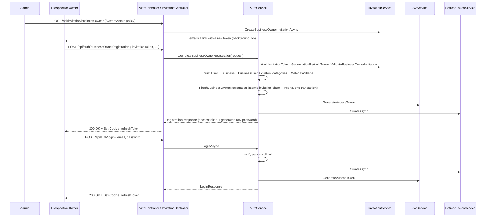

# Authentication and Authorization

MerchForge uses JWT bearer access tokens plus an opaque, database-backed refresh
token delivered via an `HttpOnly` cookie. Authorization is layered: ASP.NET Core
role claims for system-level access, a custom policy/handler pair for business
membership roles, and a second custom policy/handler pair for per-feature access
(plan-bundled or credit-purchased). Registration for a new business owner is gated
by a single-use, database-backed invitation, not open self-signup.

## Components involved

| Layer | Class | File |
|---|---|---|
| Controller | `AuthController` | `Controllers/AuthController.cs` |
| Orchestration | `AuthService` (`IAuthService`) | `Services/Auth/AuthService.cs` |
| Access tokens | `JwtService` (`IJwtService`) | `Services/Auth/JwtService.cs` |
| Refresh tokens | `RefreshTokenService` (`IRefreshTokenService`) | `Services/Auth/RefreshTokenService.cs` |
| Refresh token storage | `IRefreshTokenRepository` → `RefreshTokenRepository` | `Repositories/Implementations/RefreshTokenRepository.cs` |
| Password hashing | `IPasswordHasher<User>` (ASP.NET Core Identity's `PasswordHasher<User>`) | registered in `Program.cs` |
| Business role policy | `BusinessRoleHandler` / `BusinessRoleRequirements` | `Authorization/Handlers/`, `Authorization/Requirements/` |
| Feature policy | `FeatureHandler` / `FeatureRequirement` | `Authorization/Handlers/`, `Authorization/Requirements/` |
| Policy names | `AuthorizationPolicies` | `Authorization/AuthorizationPolicies.cs` |
| Invitations | `InvitationController`, `InvitationService` (`IInvitationService`) | `Controllers/InvitationController.cs`, `Services/Invitation/InvitationService.cs` |

## Registration and login flow



## Password hashing

Delegated entirely to ASP.NET Core Identity's `PasswordHasher<User>`
(`builder.Services.AddScoped<IPasswordHasher<User>, PasswordHasher<User>>();` in
`Program.cs`) — MerchForge implements no hashing algorithm of its own.
`AuthService.LoginAsync` calls `_passwordHasher.VerifyHashedPassword(user,
user.PasswordHash, request.Password)` and rejects on `PasswordVerificationResult.Failed`
with `InvalidCredentialsException`. Registration (`RegisterSuperAdmin`,
`CompleteBusinessOwnerRegistration`) calls `_passwordHasher.HashPassword(user,
password)` before persisting.

## JWT access tokens

**`JwtService.GenerateAccessToken(User user)`**

**Purpose**: Produces a signed, time-limited access token carrying the caller's
identity and system role.

**Process**:
1. Computes `expiration` via `GetExpirationTime()` (`DateTime.UtcNow +
   JwtOptions.AccessTokenExpirationMinutes`).
2. Loads the user's `SystemRole` via `IUserRepository.GetSystemRoleById`.
3. Builds the claim set:

| Claim | Value |
|---|---|
| `sub` (`JwtRegisteredClaimNames.Sub`) | `user.Id` |
| `email` (`JwtRegisteredClaimNames.Email`) | `user.Email` |
| `ClaimTypes.Role` | the user's `SystemRole` (`.ToString()`) |
| `ClaimTypes.NameIdentifier` | `user.Id` (duplicated from `sub` — this is the claim read everywhere in application code via `User.FindFirstValue(ClaimTypes.NameIdentifier)`) |
| `ClaimTypes.Email` | `user.Email` (duplicated from the `email` claim) |

4. Signs with `HmacSha256` using a `SymmetricSecurityKey` built from
   `JwtOptions.SecretKey` (UTF-8 bytes), and sets `Issuer`/`Audience` from
   `JwtOptions`.
5. Serializes via `JwtSecurityTokenHandler().WriteToken`.

**Constructor guard**: `JwtService`'s constructor throws
`JwtConfigurationException` (a plain `Exception`, **not** an `AppException` — see
[error-handling.md](error-handling.md)) immediately if `JwtOptions.SecretKey` is
blank — this fails fast at DI-resolution time rather than on the first login
attempt.

**Validation** (`Program.cs`, `AddJwtBearer`): `ValidateIssuer`, `ValidateAudience`,
`ValidateIssuerSigningKey`, `ValidateLifetime` are all `true`; `ClockSkew =
TimeSpan.Zero` (no grace period past expiration — the token stops working exactly at
its stated expiry).

**No refresh-token claims on the access token, and no role beyond `SystemRole`.**
Business role and feature access are *not* baked into the JWT — they're resolved
per-request against the database by the authorization handlers (see below), keyed
off the `businessId` route value. This means a role change or a plan change takes
effect on a caller's very next request, without needing to wait for their access
token to expire and be refreshed.

## Refresh tokens

**Storage**: `RefreshToken` (`Models/RefreshToken.cs`) — `Id`, `UserId`, `TokenHash`
(SHA-256 hex digest, **never the raw token**), `ExpiresAt`, `RevokedAt` (nullable),
`CreatedAt`. See [database.md](database.md#refreshtoken).

**`RefreshTokenService.CreateAsync(User user, CancellationToken)`**

**Process**: `GenerateToken()` — 64 cryptographically random bytes
(`RandomNumberGenerator.GetBytes(64)`), base64-encoded — is the raw token returned to
the caller (and eventually set as the cookie value). `HashToken(rawToken)` — a plain
SHA-256 hash, hex-encoded — is what's actually persisted in `TokenHash`. Only the
hash ever touches the database; the raw value exists only in memory and in the
cookie sent to the browser. Persisted with `ExpiresAt = UtcNow +
RefreshTokenOptions.ExpirationDays`.

**`RefreshTokenService.GetValidTokenAsync(string token, CancellationToken)`**

**Process**: Hashes the incoming raw token, looks it up by hash, and returns `null`
(not an exception) if: no row matches the hash, `RevokedAt` is set, or `ExpiresAt`
has passed. `AuthController.Refresh`/`AuthService.RefreshAsync` translate a `null`
result into `InvalidRefreshTokenException`.

**Rotation** (`RefreshTokenService.RotateAsync`): on every successful `/api/auth/refresh`
call, the presented token is marked `RevokedAt = UtcNow` **and** a brand-new token
row is created and returned — the caller's cookie is replaced with a new value on
every refresh. There is no reuse-detection beyond this: a revoked token is simply
rejected by `GetValidTokenAsync` on any subsequent use (its `RevokedAt` check), but
the code does not appear to revoke the rest of that user's tokens if a
already-revoked token is presented again (no such cascading-revocation logic was
found in `RefreshTokenService`/`AuthService`). Whether this is an intentional
trade-off or a gap could not be determined from the implementation alone.

**Logout** (`AuthService.LogoutAsync`): looks up the token from the request cookie
via `GetValidTokenAsync`; if found, calls `RevokeAsync` (sets `RevokedAt`, no-ops if
already revoked); if the cookie is missing or the token is already invalid, logout
still succeeds silently (`AuthController.Logout` always clears the cookie and
returns `204 No Content` regardless).

## The refresh-token cookie

Set by `AuthController` on every successful login/refresh/registration action via
`SetRefreshTokenCookie`, built from `RefreshTokenOptions`:

| Cookie attribute | Source | Default |
|---|---|---|
| Name | `RefreshTokenOptions.CookieName` | `"refreshToken"` |
| `HttpOnly` | always `true` | — not readable from JavaScript |
| `Secure` | `RefreshTokenOptions.Secure` | `true` |
| `SameSite` | `RefreshTokenOptions.SameSite`, parsed via `Enum.TryParse<SameSiteMode>`, falling back to `Lax` on an unparseable value | `"Lax"` |
| `Path` | `RefreshTokenOptions.CookiePath` | `"/api/Auth"` — scopes the cookie so it's only ever sent back to auth endpoints |
| `Expires` | `UtcNow + RefreshTokenOptions.ExpirationDays` | 30 days |

`Program.cs`'s CORS policy (`"Frontend"`) explicitly enables `AllowCredentials()`
alongside an origin allow-list (`Cors:AllowedOrigins`) — required for the browser to
send this cookie cross-origin at all, and the reason the storefront's separate CORS
policy (anonymous, no cookies) is allowed to use `AllowAnyOrigin()` instead (see
[architecture.md](architecture.md)).

## Method documentation — `AuthService`

### `LoginAsync(LoginRequest request, CancellationToken)`

**Process**: Looks up the user by email (`InvalidCredentialsException` if not
found); verifies the password hash (same exception on failure — the error is
identical for "no such user" and "wrong password", so a caller cannot enumerate
which emails have accounts); issues a new refresh token; loads the user's current
business membership via `IBusinessRepository.GetUserBusinessAsync` (a user has at
most one business relationship surfaced here — see
[architecture.md](architecture.md) for how the dashboard resolves this) and system
role; returns `(LoginResponse, rawRefreshToken)`.

### `RefreshAsync(string refreshToken, CancellationToken)`

**Process**: Validates the presented raw token (`InvalidRefreshTokenException` if
invalid/expired/revoked); rotates it; rebuilds the same `LoginResponse` shape as
`LoginAsync` from the token's associated user. This is why `LoginResponse` and not
a slimmer DTO is returned from `/refresh` — the frontend gets a fully-formed session
object from either endpoint.

### `RegisterSuperAdmin(RegisterSuperAdminRequest request, CancellationToken)`

**Purpose**: Bootstraps the very first `SuperAdmin` account. Deliberately
unauthenticated (no `[Authorize]` on the controller action) so it's reachable before
any account exists — but self-limiting: `IUserRepository.SuperAdminExistsAsync`
throws `SuperAdminAlreadyExistsException` if one already exists, so this endpoint is
only ever usable once in a given deployment's lifetime.

**Process**: checks no SuperAdmin exists; checks the email isn't taken
(`EmailAlreadyExistsException`); creates the `User` with the `SuperAdmin` system
role; hashes the password; persists; issues a refresh token and access token.
Returns `(AuthResponse, rawRefreshToken)` — no `Business` context, since a SuperAdmin
doesn't own a business.

### `CompleteBusinessOwnerRegistration(CompleteBusinessOwnerRegistrationRequest, CancellationToken)`

**Purpose**: Turns an accepted invitation into a real owner account, business, and
initial catalog configuration, all in one call. See
[Invitations](#invitations) below for how the invitation itself is created and
validated.

**Process**:
1. Hashes the presented `InvitationToken` and looks up the `Invitation` row by hash;
   `ValidateBusinessOwnerInvitation` throws a specific exception for each way it can
   be unusable (see below) — validation happens **before** any other work, so a bad
   token fails fast.
2. `IDomainService.EnsureDomainExistsAsync(request.BusinessDomainId)` — fails before
   creating anything if the chosen domain doesn't exist, rather than partway through
   building the user/business/category rows.
3. Checks the email isn't already registered — `EmailAlreadyExistsException`. The
   code comment notes the database's unique index on `users.Email` would catch this
   too, but only as an unhandled `DbUpdateException` surfacing as a generic 500; an
   invitation sent to an address that already has an account is an ordinary mistake,
   so it gets a named `Conflict` instead.
4. Generates a **random password** via `PasswordGenerator.Generate()` (not chosen by
   the registering owner) — hashed and stored, and also returned in the plaintext
   response (`RegistrationResponse.rawPassword`) so the frontend can display it once.
   There is no "owner sets their own password" step in this flow as read from the
   code.
5. `IDomainService.BuildMetadataShapeAsync` snapshots the chosen optional product
   fields (`SelectedProductAttributeKeys`) into `Business.MetadataShape` — built
   before the `Business` entity itself, so an unknown key fails the whole request
   before anything is created.
6. `IDomainService.BuildCustomCategoriesAsync` turns any `NewCategoryNames` not
   already matching a platform category in the domain into private `Category` rows
   owned by the new business.
7. `IUserRepository.FinishBusinessOwnerRegistration` — a single database
   transaction that: **atomically claims the invitation** via `ExecuteUpdateAsync`
   (`WHERE Id = ... AND AcceptedAt IS NULL AND RevokedAt IS NULL AND ExpiresAt >
   UtcNow`, setting `AcceptedAt`), throwing `InvitationAlreadyUsedException` if the
   claim affects zero rows — the same race-safe conditional-update pattern used
   elsewhere in this codebase (draft confirmation, credit consumption, website
   template selection); then inserts the `User`, `Business`, `BusinessUser`, and any
   custom `Category` rows. Claiming the invitation *inside* the same transaction as
   the inserts is what closes the race window where two concurrent requests for the
   same token could both pass the earlier validation and each create a business.
8. Issues a refresh token and access token; returns `(RegistrationResponse,
   rawRefreshToken)`.

## Invitations

**Purpose**: Registration for a new business owner is invite-only — there is no
open "sign up" endpoint for creating a business. An existing `SystemAdmin` (or
`SuperAdmin`) issues an invitation; the invitee redeems it during registration.

**`InvitationController.CreateBusinessOwnerInvitation`** —
`POST /api/invitation/business-owner`, gated by
`[Authorize(Policy = AuthorizationPolicies.SystemAdmin)]` (`SuperAdmin` or `Admin`
system role).

**`InvitationService.CreateBusinessOwnerInvitationAsync`**:
1. Revokes any still-pending (`AcceptedAt == null && RevokedAt == null && ExpiresAt >
   now`) prior invitation for the same email and type — so re-inviting someone
   invalidates their earlier link rather than leaving two live tokens.
2. Generates a random 32-byte token (`GenerateInvitationToken`, base64-encoded);
   stores only its SHA-256 hash (`HashInvitationToken`) — the raw token is never
   persisted, mirroring the refresh-token pattern.
3. Sets `ExpiresAt = now + 48 hours`, `Type = BusinessOwner`, `BusinessId = null`
   (no business exists yet), `BusinessRole = Owner`, `SystemRole = User`.
4. Builds an acceptance link
   (`{Frontend:BaseUrl}/accept-invitation?token=...&email=...`) and enqueues
   `SendBusinessOwnerInvitationJob` via Hangfire — the email is sent out-of-band, not
   inline with the request (see [architecture.md](architecture.md) for the
   background-job pattern).
5. Returns `InvitationResponse { Email, ExpiresAt }` — the raw token is **not**
   included in the response; it only ever exists in the email link.

**`ValidateBusinessOwnerInvitation`** — throws a specific, named exception per
failure mode rather than one generic error:

| Condition | Exception |
|---|---|
| No invitation matches the hash | `InvalidInvitationException` |
| `Type != BusinessOwner` | `InvalidInvitationException` |
| Already accepted | `InvitationAlreadyUsedException` |
| Revoked | `InvitationRevokedException` |
| Past `ExpiresAt` | `InvitationExpiredException` |
| `BusinessRole != Owner` or `SystemRole != User` | `InvalidInvitationException` |

## Authorization

Three independent mechanisms, layered by stacking `[Authorize]` attributes (all
attached policies on a controller/action must pass):

### 1. System role (built-in ASP.NET Core role claims)

```csharp
options.AddPolicy(AuthorizationPolicies.SystemSuperAdmin, p => p.RequireRole(SystemRole.SuperAdmin.ToString()));
options.AddPolicy(AuthorizationPolicies.SystemAdmin, p => p.RequireRole(SystemRole.SuperAdmin.ToString(), SystemRole.Admin.ToString()));
```

Uses the standard `ClaimTypes.Role` claim baked into the JWT at login — no database
lookup needed at authorization time. Used by `InvitationController` (`SystemAdmin`).

### 2. Business role — `BusinessRoleHandler` / `BusinessRoleRequirements`

Policies: `BusinessMember` (Member, Admin, or Owner), `BusinessAdmin` (Admin or
Owner), `BusinessOwner` (Owner only) — each constructed with a
`BusinessRoleRequirements(params BusinessRole[] allowedRoles)`.

**`BusinessRoleHandler.HandleRequirementAsync`**:
1. Reads the caller's user id from the `ClaimTypes.NameIdentifier` claim; fails
   (leaves the requirement unsatisfied) silently if unparseable.
2. Reads `businessId` **from the request's route values**
   (`httpContext.Request.RouteValues["businessId"]`) — not from the request body or
   query string. This is why every gated controller routes `businessId` as a path
   segment (`api/businesses/{businessId:guid}/...`); a route without it would leave
   the policy unable to resolve which business to check, and the requirement would
   simply never succeed.
3. Looks up the `BusinessUser` row for `(userId, businessId)` directly against the
   `DbContext` (not through a repository) — no match means the requirement fails
   silently.
4. Resolves the row's `BusinessRole` via `IUserRepository.GetBusinessRoleById` and
   succeeds only if it's in `requirement.AllowedRoles`.

**No explicit failure/error message**: like all ASP.NET Core authorization
handlers, not calling `context.Succeed` simply leaves the requirement unmet: the
framework returns a generic `403 Forbidden` (or `401` if unauthenticated) with no
MerchForge-specific error body — this bypasses the `AppException`/`GlobalExceptionHandler`
pipeline entirely (see [error-handling.md](error-handling.md)).

### 3. Feature access — `FeatureHandler` / `FeatureRequirement`

Policies: `Feature.Products`, `Feature.Telegram`, `Feature.WhatsApp`,
`Feature.AiProductGeneration`, `Feature.AiImageEditing` — each constructed with a
`FeatureRequirement(string featureKey)` naming one `FeatureKeys` constant.

**`FeatureHandler.HandleRequirementAsync`**: same `businessId`-from-route pattern as
`BusinessRoleHandler`, then delegates entirely to
`ISubscriptionService.HasFeatureAsync(businessId, requirement.FeatureKey)` — true if
the business's active subscription plan bundles the feature, **or** it holds a
positive credit balance for it (see
[ai/README.md](ai/README.md#credit-metering) and
[database.md](database.md#feature-credits-independent-of-plans) for the full
credit-purchase mechanism). No caching — this is a fresh check on every request, so a
plan change or credits running out takes effect immediately on the next call.

**Where feature policies are actually applied**: only `ProductDraftsController`
(`Feature.AiProductGeneration`) and `ImageEditingController`
(`Feature.AiImageEditing`) carry a feature policy in the current codebase — both
stacked alongside `BusinessOwner`. `Feature.Products` is defined in
`AuthorizationPolicies` and seeded as a `FeatureKeys` constant but is **not** applied
to `BusinessDashboardController` (manual product CRUD) — see
[products/product-management.md](products/product-management.md#authorization) for
this observation in context.

## Business ownership as the authorization boundary

Every business-scoped controller (`BusinessDashboardController`,
`ProductDraftsController`, `ImageEditingController`) carries
`[Authorize(Policy = AuthorizationPolicies.BusinessOwner)]` at the class level —
meaning every action on these controllers requires the caller to be the specific
business's `Owner`, not merely an `Admin` or `Member`. There is currently no
inspected controller in this codebase that uses the more permissive
`BusinessMember`/`BusinessAdmin` policies to allow non-owner staff narrower access —
whether that's planned but unbuilt, or intentionally out of scope, could not be
determined from the code.

## Related documents

- [database.md](database.md#refreshtoken) — `RefreshToken`, `User`, `BusinessUser`,
  `BusinessUserRole`, `Invitation` schemas.
- [ai/README.md](ai/README.md#credit-metering) — how the feature-authorization
  policy interacts with credit metering for the two AI features.
- [error-handling.md](error-handling.md) — how `AppException` subclasses here map
  to HTTP responses, and the gap for `JwtConfigurationException` (not an
  `AppException`) and unauthenticated/unauthorized responses (bypass the exception
  pipeline entirely).
- [configuration.md](configuration.md) — `Jwt`, `RefreshToken`, and `Cors` configuration keys.
