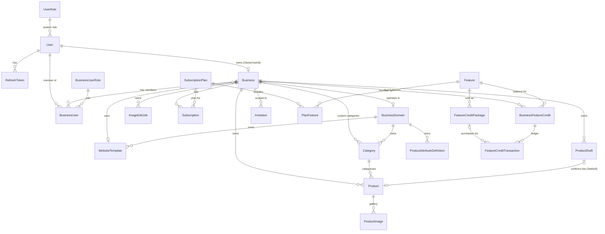

# Database

MerchForge uses EF Core 9 against MariaDB via
`Pomelo.EntityFrameworkCore.MySql` (+ `Pomelo.EntityFrameworkCore.MySql.Json.Microsoft`
for native `JsonDocument` column mapping). The context is `MerchForgeDbContext`
(`Data/MerchForgeDbContext.cs`); every entity's table mapping, constraints, indexes,
and seed data live in a matching `IEntityTypeConfiguration<T>` class under
`Configurations/`, auto-discovered via
`modelBuilder.ApplyConfigurationsFromAssembly(...)` — there is no configuration
logic inline in `OnModelCreating` beyond that one call.

## Conventions used throughout the schema

- **Enums are stored as their string name, not their ordinal**, everywhere an enum
  reaches the database (`ProductDraftStatus`, `ImageEditJobStatus`,
  `ProductAttributeValueType`, `SubscriptionStatus`, `BillingInterval`,
  `FeatureCreditTransactionType`, `BusinessRole`, `SystemRole`). The configurations
  explain why consistently: an ordinal would silently change meaning if a value were
  ever inserted into the middle of an enum, or — for `ProductAttributeValueType`
  specifically — because it is snapshotted into `Business.MetadataShape` and must
  stay stable independent of enum declaration order.
- **JSON columns are real `json` columns**, not serialized strings, via the Pomelo
  `Json.Microsoft` plugin (`UseMicrosoftJson()` in `Program.cs`). On MariaDB this
  resolves to `LONGTEXT` with an automatic `CHECK (json_valid(...))` constraint, so
  malformed JSON is rejected by the database itself, not only by application code.
  Used for: `Product.Metadata`, `Product.Tags`, `Business.MetadataShape`,
  `ProductAttributeDefinition.AllowedValues`, `ProductDraft.Draft`,
  `ProductDraft.Messages`, `ImageEditJob.InputImageUrls`.
- **Seed data uses a fixed timestamp** (`BusinessDomainConfiguration.SeedTimestamp`,
  `2026-01-01T00:00:00Z`) rather than `DateTime.UtcNow`, because `HasData` must
  produce a deterministic model — a live timestamp would make EF detect a spurious
  model change on every migration scaffold.
- **Delete behavior is chosen deliberately per relationship**, not defaulted — see
  each table's notes below and the [cascade-behavior summary](#cascade-behavior-summary).

## Entity-relationship diagram

Only relationships that exist in the code are shown.

## Tables

### `User`
Table: `users`.

| Column | Type | Constraints |
|---|---|---|
| `Id` | `Guid` | PK |
| `Email` | `string` | required, max 255, **unique index** |
| `SystemRoleId` | `Guid` | FK → `UserRole` (no explicit relationship configured in `UserConfigurations` — see note) |
| `PasswordHash` | `string` | required |
| `FirstName` / `LastName` | `string` | required, max 100 each |
| `CreatedAt` / `UpdatedAt` | `DateTime` | required |

Navigation: `BusinessMemberships` (→ `BusinessUser`), `RefreshTokens`.

Note: `SystemRoleId` exists as a scalar FK column on the model, but
`UserConfigurations.Configure` does not itself declare a `HasOne`/`WithMany`
relationship to `UserRole` — the relationship, if enforced at the database level, is
established implicitly by EF Core's convention-based discovery rather than an
explicit fluent configuration in this file. The exact FK delete behavior for this
specific relationship could not be confirmed from `UserConfigurations.cs` alone.

### `UserRole`
Table: (default, `UserRoles`). Seeded, fixed ids: `SuperAdmin`
(`11111111-...`), `Admin` (`22222222-...`), `User` (`33333333-...`) — see
`SystemRole` enum. `Role` stored as its string name, max 50.

### `Business`
Table: `businesses`.

| Column | Type | Constraints |
|---|---|---|
| `Id` | `Guid` | PK |
| `Name` | `string` | required, max 255 |
| `OwnerUserId` | `Guid` | FK → `User`, **Restrict** |
| `BusinessDomainId` | `Guid?` | FK → `BusinessDomain`, **Restrict**. Nullable — a business exists before it picks a vertical. |
| `Description` | `string?` | max 1000 |
| `LogoUrl` | `string?` | max 500 |
| `Currency` | `string` | required, max 3, default `"USD"` |
| `Locale` | `string` | required, max 10, default `"en-US"` |
| `ContactEmail` | `string?` | max 255 |
| `ContactPhone` | `string?` | max 50 |
| `WebsiteTemplateId` | `Guid?` | FK → `WebsiteTemplate`, **Restrict**. Null = business has no storefront yet — deliberately the only signal for that, so there's no separate `HasWebsite` flag that could drift out of sync. |
| `WebsiteTemplateChosenAt` | `DateTime?` | null exactly when `WebsiteTemplateId` is null |
| `MetadataShape` | `JsonDocument?` | column `meta_data_shape`, type `json`. Snapshot of the domain's `ProductAttributeDefinition` catalogue at onboarding — see [products/product-management.md](products/product-management.md#metadata). |
| `CreatedAt` / `UpdatedAt` | `DateTime` | required |

Both FK relationships from `Business` (`BusinessDomain`, `WebsiteTemplate`) are
**Restrict**, not Cascade: retiring a domain or a template must never cascade into
silently deleting or corrupting the businesses that reference it.

### `BusinessUser` (business membership)
Table: `business_users`. **Composite PK**: `(BusinessId, UserId)`.

| Column | Type | Constraints |
|---|---|---|
| `BusinessId` | `Guid` | PK part, FK → `Business`, **Cascade** |
| `UserId` | `Guid` | PK part, FK → `User`, **Cascade** |
| `RoleId` | `Guid` | required, FK → `BusinessUserRole` |
| `CreatedAt` / `UpdatedAt` | `DateTime` | |

This is the many-to-many join between `User` and `Business`, carrying the member's
role. Both cascade paths delete the membership row if either the business or the
user is deleted.

### `BusinessUserRole`
Seeded, fixed ids matching `BusinessRole`: `Owner` (`11111111-...`), `Admin`
(`22222222-...`), `Member` (`33333333-...`). `Role` stored as its string name, max
50.

### `RefreshToken`
Table: `refresh_tokens`.

| Column | Type | Constraints |
|---|---|---|
| `Id` | `Guid` | PK |
| `UserId` | `Guid` | FK → `User`, **Cascade** |
| `TokenHash` | `string` | required, max 255, **unique index** |
| `ExpiresAt` | `DateTime` | required |
| `RevokedAt` | `DateTime?` | |
| `CreatedAt` | `DateTime` | required |

See [authentication.md](authentication.md) for how this is issued, validated, and
rotated.

### `Invitation`
No `ToTable` call in `InvitationConfiguration` (uses the default pluralized table
name).

| Column | Type | Constraints |
|---|---|---|
| `Id` | `Guid` | PK |
| `Email` | `string` | required, max 320 |
| `TokenHash` | `string` | required, max 128, **unique index** |
| `Type` | `InvitationType` | required (`BusinessOwner` \| `BusinessMember`) — **not** configured with `HasConversion<string>()`, unlike every other stored enum in this schema, so it is likely persisted as its numeric ordinal. This inconsistency could not be resolved further from the configuration file alone. |
| `BusinessId` | `Guid?` | FK → `Business`, **SetNull** |
| `BusinessRole` | `BusinessRole?` | optional |
| `SystemRole` | `SystemRole?` | optional, no explicit column configuration found |
| `CreatedByUserId` | `Guid` | FK → `User`, **Restrict** |
| `CreatedAt` / `UpdatedAt` / `ExpiresAt` | `DateTime` | `CreatedAt`/`ExpiresAt` required |
| `AcceptedAt` / `RevokedAt` | `DateTime?` | |
| `EmailSentAt` / `EmailDeliveryFailedAt` | `DateTime?` | |
| `EmailDeliveryError` | `string?` | |

Index on `Email` (non-unique — an address can be invited more than once, e.g. after
expiry/revocation).

### `BusinessDomain`
Table: `business_domains`. Seeded: **Fashion**, **Restaurant**, **Electronics**
(fixed ids in `BusinessDomainConfiguration`). `Slug` has a unique index (the public
identifier). `Name`/`Slug` required, max 100.

### `Category`
Table: `categories`.

| Column | Type | Constraints |
|---|---|---|
| `Id` | `Guid` | PK |
| `BusinessDomainId` | `Guid` | FK → `BusinessDomain`, **Restrict** |
| `BusinessId` | `Guid?` | FK → `Business` (custom categories), **Restrict**. Null = shared platform category. |
| `Name` | `string` | required, max 100 |
| `Slug` | `string` | required, max 100 |
| `DisplayOrder` | `int` | required |
| `IsActive` | `bool` | required |

**Unique index**: `(BusinessDomainId, BusinessId, Slug)` — a slug is unique per
domain *and* owning business, not per domain alone, so two different businesses can
each privately own a "vintage" category without colliding. Documented caveat in the
code: MariaDB treats every `NULL` as distinct in a unique index, so this does **not**
prevent two platform categories (`BusinessId IS NULL`) from sharing a slug within a
domain — accepted because platform categories are only ever created by seeding, not
by any runtime request path. Also indexed on `BusinessId` alone.

Seeded: 3 categories per domain (Shoes/Shirts/Accessories for Fashion,
Pizza/Burgers/Drinks for Restaurant, Phones/Laptops/Accessories for Electronics).

### `ProductAttributeDefinition`
Table: `product_attribute_definitions`. The platform's catalogue of metadata fields a
business *may* opt into (see
[products/product-management.md](products/product-management.md#metadata)).

| Column | Type | Constraints |
|---|---|---|
| `Id` | `Guid` | PK |
| `BusinessDomainId` | `Guid` | FK → `BusinessDomain`, **Restrict** |
| `Key` | `string` | required, max 100 — the JSON key in `Product.Metadata` |
| `Label` | `string` | required, max 100 |
| `ValueType` | `ProductAttributeValueType` | required, stored as name, max 20 |
| `IsRequired` | `bool` | required |
| `AllowedValues` | `JsonDocument?` | type `json` — closed set of permitted values, or null for free-form |
| `DisplayOrder` | `int` | required |
| `IsActive` | `bool` | required — lets a field be retired without breaking businesses that already snapshotted it |

**Unique index**: `(BusinessDomainId, Key)` — one definition per key per domain (the
same key, e.g. `"color"`, can independently exist under both Fashion and
Electronics).

Seeded per domain — 11 Fashion fields (`colors` `ColorList` required, `sizes`
`TextList` required with allowed values `XS/S/M/L/XL/2XL`, `material`, `fit`,
`pattern`, `gender`, `season`, `careInstructions`, `countryOfOrigin`, `handmade`
`Boolean`, `brand`), 10 Restaurant fields (`ingredients`, `allergens` `TextList`;
`spicy`, `vegetarian`, `vegan`, `glutenFree` `Boolean`; `calories`,
`preparationMinutes` `Number`; `portionSize`, `servingTemperature` `Text`), 10
Electronics fields (`brand`, `model`, `storage`, `ram`, `screenSize`,
`batteryCapacity` `Text`; `colors` `ColorList`; `connectivity` `TextList`;
`operatingSystem` `Text`; `warrantyMonths` `Number`).

### `WebsiteTemplate`
Table: `website_templates`.

| Column | Type | Constraints |
|---|---|---|
| `Id` | `Guid` | PK |
| `BusinessDomainId` | `Guid` | FK → `BusinessDomain`, **Restrict** |
| `Name` | `string` | required, max 100, **unique index (global, not per-domain)** — this identifies the physical deployed template project, so a collision across domains would be ambiguous, not merely a display clash |
| `Label` | `string` | required, max 150 |
| `VideoPreviewUrl` | `string` | required, max 500 |
| `IsActive` | `bool` | required |
| `DisplayOrder` | `int` | required |

Seeded: one Fashion template (`fashion-template-01` / "Vineta Fashion") and one
Electronics template (`electronic-template-01` / "Vineta Electronics"), both with a
placeholder `VideoPreviewUrl`.

### `Product`
Table: `products`. Full field reference in
[products/product-management.md](products/product-management.md#product).

| Column | Type | Constraints |
|---|---|---|
| `Id` | `Guid` | PK |
| `BusinessId` | `Guid` | FK → `Business`, **Cascade** — a business's catalog is genuinely owned data |
| `CategoryId` | `Guid` | FK → `Category`, **Restrict** — a category is shared reference data, never cascade-deleted |
| `Title` | `string` | required, max 255 |
| `Description` | `string?` | (made nullable in a later migration; no explicit max length configured) |
| `Price` | `decimal(10,2)` | required |
| `CompareAtPrice` | `decimal(10,2)?` | |
| `ImageUrl` | `string?` | max 500 |
| `Sku` | `string?` | max 100 |
| `StockQuantity` | `int?` | |
| `Tags` | `List<string>` | type `json`, DB default `(JSON_ARRAY())` — so adding this `NOT NULL`-equivalent column to existing rows has a valid backfill value |
| `SaleEndsAt` | `DateTime?` | |
| `Metadata` | `JsonDocument?` | type `json` |
| `CreatedAt` / `UpdatedAt` | `DateTime` | |

**Check constraints** (enforced by MariaDB, not just application validation):
- `CK_products_CompareAtPrice_GreaterThanPrice`: `` `CompareAtPrice` IS NULL OR `CompareAtPrice` > `Price` ``
- `CK_products_StockQuantity_NonNegative`: `` `StockQuantity` IS NULL OR `StockQuantity` >= 0 ``

**Indexes**: `BusinessId`; composite `(BusinessId, CategoryId)` (storefront listing
is always business-scoped and usually category-filtered); **unique**
`(BusinessId, Sku)` — a SKU is unique per business, not platform-wide, and MariaDB's
treatment of `NULL` as distinct means any number of SKU-less products coexist freely.

### `ProductImage`
Table: `product_images`. Full field reference in
[products/product-management.md](products/product-management.md#productimage).

| Column | Type | Constraints |
|---|---|---|
| `Id` | `Guid` | PK |
| `ProductId` | `Guid` | FK → `Product`, **Cascade** — a gallery is genuinely owned by its product |
| `Url` | `string` | required, max 500 |
| `IsMain` | `bool` | |
| `Width` / `Height` | `int?` | |
| `AltText` | `string?` | max 255 |
| `DisplayOrder` | `int` | |

**"Exactly one main image per product" — enforced by the database, not just app
code.** A computed, stored column `MainImageProductId`
(`CASE WHEN IsMain = 1 THEN ProductId ELSE NULL END`) backs a **unique index**
(`UX_product_images_OneMainPerProduct`). Because MariaDB treats every `NULL` as
distinct in a unique index, this index only actually constrains the `IsMain = true`
rows — a second main image for the same product collides on this computed value and
is rejected, while any number of non-main images coexist freely. Also indexed on
`(ProductId, DisplayOrder)` — the shape every gallery read query uses.

### `ProductReview`
Table: `product_reviews`. A customer's rating of one product: a required 1-5 star
rating plus an optional comment. That two-field shape is a platform-wide convention
every storefront template renders the same way, not a per-business setting.

| Column | Type | Constraints |
|---|---|---|
| `Id` | `Guid` | PK |
| `ProductId` | `Guid` | FK → `Product`, **Cascade** |
| `BusinessId` | `Guid` | FK → `Business`, **Cascade**. Denormalized from `Product.BusinessId` so owner-side moderation queries don't join through `Product` — same reasoning as `StockMovement.BusinessId`. A product never moves between businesses, so it can't drift |
| `CustomerId` | `Guid` | FK → `Customer`, **Cascade** |
| `Rating` | `int` | required, `CK_product_reviews_Rating_Range` (`BETWEEN 1 AND 5`) |
| `Comment` | `string?` | max 2000 |
| `IsHidden` | `bool` | required |
| `CreatedAt` / `UpdatedAt` | `DateTime` | required |

**One review per customer per product, enforced by the database.** A unique index
`UX_product_reviews_OnePerCustomerPerProduct` on `(ProductId, CustomerId)` means the
write path is an upsert rather than an insert — a customer re-submitting edits their
existing review instead of adding a second one, and the constraint holds even under a
race that a check-then-insert in the service would lose.

**Only verified purchasers can create one.** Eligibility is "has at least one order
with this business, not `Cancelled`, containing this product" — the same loose
definition of a real order that `DashboardRepository` and `OrderRepository` already
use. `PaymentStatus` is deliberately not consulted, since there is no payment gateway
and it is effectively always `Pending`. Because purchase is required, every row is a
verified purchase by construction and there is no `IsVerifiedPurchase` column. Guest
orders have no `CustomerId` and can never qualify their buyer.

**Hiding is not deleting.** `IsHidden` removes a review from the storefront list and
from the product's average rating, but it stays in the table and stays visible in the
owner's moderation view, so it can be put back. Editing a hidden review does not
un-hide it.

Indexed on `(ProductId, IsHidden, CreatedAt)` for the storefront read and
`(BusinessId, CreatedAt)` for the owner's. Average rating and review count are
computed as correlated subqueries in the storefront product projections rather than
denormalized onto `Product`, matching how `StorefrontCategoryResponse.ProductCount`
is done.

### `ProductDraft`
Table: `product_drafts`. Full field reference in
[ai/product-generation.md](ai/product-generation.md#data-model-productdraft).

| Column | Type | Constraints |
|---|---|---|
| `Id` | `Guid` | PK |
| `BusinessId` | `Guid` | FK → `Business`, **Cascade** |
| `CreatedByUserId` | `Guid` | (no explicit relationship configured — recorded for audit only, per the model's own doc comment) |
| `Status` | `ProductDraftStatus` | required, stored as name, max 40 |
| `Draft` | `JsonDocument?` | type `json` |
| `Messages` | `JsonDocument?` | type `json` |
| `OriginalImageUrl` | `string?` | max 500 |
| `ProcessedImageUrl` | `string?` | max 500 |
| `ImageModificationPrompt` | `string?` | max 1000 |
| `ProductId` | `Guid?` | FK → `Product`, **SetNull** — deleting a product the owner later reconsidered must not erase the conversation that produced it |
| `Provider` | `string?` | max 50 |
| `ConversationId` | `string?` | max 255 |
| `LastMessageAt` / `CreatedAt` / `UpdatedAt` | `DateTime` | |

**Indexes**: `(BusinessId, Status)` (drafts are always listed/looked-up per
business); `(BusinessId, Provider, ConversationId)` (for a future non-dashboard
ingestion channel — see [ai/product-generation.md](ai/product-generation.md#known-limitations-and-unresolved-behavior)).

### `ImageEditJob`
Table: `image_edit_jobs`. Full field reference in
[ai/image-editing.md](ai/image-editing.md#data-model-imageeditjob).

| Column | Type | Constraints |
|---|---|---|
| `Id` | `Guid` | PK |
| `BusinessId` | `Guid` | required, FK → `Business`, **Cascade** |
| `CreatedByUserId` | `Guid` | required (no explicit relationship configured) |
| `Prompt` | `string` | required, max 2000 |
| `InputImageUrls` | `JsonDocument` | required, type `json` |
| `OutputImageUrl` | `string?` | max 500 |
| `Status` | `ImageEditJobStatus` | required, stored as name, max 50 |
| `ErrorMessage` | `string?` | max 1000 |
| `CreatedAt` / `UpdatedAt` | `DateTime` | required |

Indexed on `BusinessId`.

### `SubscriptionPlan`
Table: `subscription_plans`.

| Column | Type | Constraints |
|---|---|---|
| `Id` | `Guid` | PK |
| `Name` | `string` | required, max 100, indexed (non-unique) |
| `Description` | `string?` | max 500 |
| `Price` | `decimal(18,2)` | required |
| `Currency` | `string` | required, max 3 |
| `BillingInterval` | `BillingInterval` | required, stored as name, max 50 (`Monthly` \| `Yearly`) |
| `IsActive` | `bool` | required |
| `IsCustom` | `bool` | required |

`PlanFeatures` cascades from the plan (deleting a plan deletes its feature bundles);
`Subscriptions` restricts (a plan referenced by an active subscription cannot be
silently orphaned by deleting the plan row).

### `Feature`
Table: `features`.

| Column | Type | Constraints |
|---|---|---|
| `Id` | `Guid` | PK |
| `Key` | `string` | required, max 100, **unique index** |
| `Name` | `string` | required, max 150 |
| `Description` | `string?` | max 500 |
| `IsActive` | `bool` | required |
| `SupportsCreditPurchase` | `bool` | required — explicit flag, not inferred from "has packages" (see the model's own doc comment) |

Seeded: `ai.product_generation` ("AI Product Creation") and `ai.image_editing` ("AI
Image Editing"), both `IsActive = true`, `SupportsCreditPurchase = true`. No
plan-bundled feature (`products`, `telegram`, `whatsapp` from `FeatureKeys`) is
seeded here — meaning `PlanFeature` rows bundling those into a plan, if any exist,
are created outside of migrations (e.g. by hand, or a not-yet-inspected seeding path).

### `PlanFeature`
Table: `plan_features`. **Composite PK**: `(SubscriptionPlanId, FeatureId)`. Both FKs
**Cascade**. `Limit` (`int?`) — optional usage cap for a plan-bundled feature; not
consumed by any code path found in this pass (the credit-metering system is
independent of this field — see [Feature credits](#feature-credits-independent-of-plans)
below).

### `Subscription`
Table: `subscriptions`.

| Column | Type | Constraints |
|---|---|---|
| `Id` | `Guid` | PK |
| `BusinessId` | `Guid` | required, FK → `Business`, **Cascade**, indexed |
| `SubscriptionPlanId` | `Guid` | required, FK → `SubscriptionPlan`, **Restrict**, indexed |
| `Status` | `SubscriptionStatus` | required, stored as name, max 50 (`Active` \| `Trialing` \| `PastDue` \| `Cancelled` \| `Expired`) |
| `CurrentPeriodStart` / `CurrentPeriodEnd` | `DateTime` | required |
| `Provider` | `string?` | max 50 — reserved for a real payment provider, unused today |
| `ExternalSubscriptionId` | `string?` | max 255, **unique index filtered to non-null values** (`WHERE external_subscription_id IS NOT NULL`) |

### Feature credits (independent of plans)

Three tables implement buying a feature independently of a subscription plan (see
[ai/README.md](ai/README.md#credit-metering)):

**`FeatureCreditPackage`** (`feature_credit_packages`) — a purchasable SKU.
`FeatureId` (FK → `Feature`, **Cascade**, indexed), `Name` (max 150), `Credits`
(`int`), `Price` (`decimal(10,2)`), `Currency` (max 3), `IsActive`. Seeded: Starter
(50 credits / $5) and Pro (200 credits / $15) for `ai.product_generation`; Starter
(20 credits / $5) and Pro (100 credits / $20) for `ai.image_editing` — image editing
priced at fewer credits per dollar, since a single edit call costs meaningfully more
than one text turn (per the seed data's own comment). Prices are explicitly
placeholder-easy-to-change, since nothing else is keyed to the exact numbers, only to
each package's `Id`.

**`BusinessFeatureCredit`** (`business_feature_credits`) — one row per
`(BusinessId, FeatureId)`, **unique index** enforcing that. `CreditsRemaining`
(`int`), `CreditsGrantedTotal` (`int`, lifetime total for display purposes — the
remaining balance alone can't show how much has been used). Both `BusinessId` and
`FeatureId` FKs are **Cascade**.

**`FeatureCreditTransaction`** (`feature_credit_transactions`) — an append-only
ledger. `BusinessFeatureCreditId` (FK → `BusinessFeatureCredit`, **Cascade**,
indexed), `Type` (`FeatureCreditTransactionType`, stored as name, max 50: `Purchase`
\| `Consumption`), `Amount` (`int` — positive for a purchase, `-1` for a
consumption), `BalanceAfter` (`int`, the resulting balance, for audit without
recomputing history), `FeatureCreditPackageId` (`Guid?`, FK → `FeatureCreditPackage`,
**Restrict**, set only on a `Purchase` row), `Reference` (`string?`, max 255, set
only on a `Consumption` row — e.g. a `ProductDraft.Id` or `ImageEditJob.Id`).

**Why a ledger, not just a mutable counter**: per the model's own doc comment, credit
balances are money-adjacent state, so every change is recorded as its own row rather
than only ever mutating `BusinessFeatureCredit.CreditsRemaining` in place.

**Race-safety of consumption**: `FeatureCreditRepository.TryConsumeCreditAsync` runs
an explicit `BeginTransactionAsync`, inside which a single `ExecuteUpdateAsync`
performs `UPDATE business_feature_credits SET CreditsRemaining = CreditsRemaining - 1
... WHERE BusinessId = @b AND Feature.Key = @k AND CreditsRemaining > 0` — the
`CreditsRemaining > 0` guard is part of the `UPDATE`'s own `WHERE` clause, not a
preceding `SELECT`, so it can never race with a concurrent call the way a
read-then-write would; a row that hits exactly `0` simply matches zero rows on the
next call and returns `false`. The code comment notes this needs an *explicit*
transaction (unlike a single `ExecuteUpdateAsync` alone) specifically because it
spans two statements — the conditional decrement and the ledger insert that follows
— which must land together or not at all. `GrantCreditsAsync` (a purchase) uses the
simpler pattern of relying on a single `SaveChangesAsync` call to commit both the
balance upsert and its ledger row atomically, since both go through the change
tracker together rather than one of them bypassing it via `ExecuteUpdateAsync`.

## Cascade-behavior summary

| Relationship | On delete of parent | Reasoning (from code comments) |
|---|---|---|
| `Business.OwnerUserId` → `User` | Restrict | (not elaborated in the configuration beyond the annotation absence — inferred from context) |
| `Business.BusinessDomainId` → `BusinessDomain` | Restrict | Retiring a domain must not cascade into deleting businesses. |
| `Business.WebsiteTemplateId` → `WebsiteTemplate` | Restrict | Retiring a template must not wipe out which template a business already chose. |
| `BusinessUser` → `Business` / `User` | Cascade / Cascade | Membership rows have no independent meaning once either side is gone. |
| `RefreshToken.UserId` → `User` | Cascade | A deleted user's tokens are meaningless. |
| `Invitation.BusinessId` → `Business` | SetNull | (System-level invitations have no business; a deleted business's pending invitations become orphaned rather than deleted.) |
| `Invitation.CreatedByUserId` → `User` | Restrict | An invitation's issuer must remain resolvable. |
| `Category.BusinessDomainId` → `BusinessDomain` | Restrict | Retiring a domain must not silently delete categories products still reference. |
| `Category.BusinessId` → `Business` | Restrict | No business-deletion feature exists yet; explicit reassignment/deletion of custom categories would be required first if one is built (documented as a known gap in the config file itself). |
| `ProductAttributeDefinition.BusinessDomainId` → `BusinessDomain` | Restrict | Must not delete field definitions businesses have already snapshotted. |
| `WebsiteTemplate.BusinessDomainId` → `BusinessDomain` | Restrict | Must not delete templates businesses have already chosen. |
| `Product.BusinessId` → `Business` | Cascade | A business's catalog is genuinely owned data. |
| `Product.CategoryId` → `Category` | Restrict | A category is shared reference data across the whole domain. |
| `ProductImage.ProductId` → `Product` | Cascade | A gallery is genuinely owned by its product. |
| `ProductReview.ProductId` → `Product` | Cascade | Reviews of a deleted product have nothing left to be about. |
| `ProductReview.BusinessId` → `Business` | Cascade | |
| `ProductReview.CustomerId` → `Customer` | Cascade | Unlike `Order.CustomerId`, which is SetNull because an order is the business's financial record: a review is the customer's own words, so deleting the account takes them with it. |
| `ProductDraft.BusinessId` → `Business` | Cascade | |
| `ProductDraft.ProductId` → `Product` | SetNull | Deleting a product must not erase the conversation that created it. |
| `ImageEditJob.BusinessId` → `Business` | Cascade | |
| `Subscription.BusinessId` → `Business` | Cascade | |
| `Subscription.SubscriptionPlanId` → `SubscriptionPlan` | Restrict | A plan referenced by a live subscription can't be silently orphaned. |
| `PlanFeature` → `SubscriptionPlan` / `Feature` | Cascade / Cascade | Bundle rows have no independent meaning. |
| `FeatureCreditPackage.FeatureId` → `Feature` | Cascade | |
| `BusinessFeatureCredit.BusinessId` / `.FeatureId` → `Business` / `Feature` | Cascade / Cascade | |
| `FeatureCreditTransaction.BusinessFeatureCreditId` → `BusinessFeatureCredit` | Cascade | Ledger rows have no independent meaning. |
| `FeatureCreditTransaction.FeatureCreditPackageId` → `FeatureCreditPackage` | Restrict | A ledger row must keep referencing the exact package that was purchased. |

## Migrations

45 migration files exist under `Migrations/` at the time of writing, spanning the
initial schema through the most recent additions (`AddFeatureCreditPurchases`,
`AddWebsiteTemplates`, `AddImageEditingFeature`, `AddColorListAttributeType`,
`AddProductAttributeDefinitionsAndMetadataShape`,
`ReworkProductDraftForAiConversations`, `AddFixedProductMerchandisingFields`,
`AddProductImages`, `MakeProductDescriptionNullable`,
`RenameGarmentSizeXxlTo2xl`, among others visible in the migration file names). The
current schema described in this document reflects the cumulative effect of all of
them, as expressed by the entity configurations above and
`Migrations/MerchForgeDbContextModelSnapshot.cs` — individual migrations are not
itemized here since the configurations are the authoritative, current-state source.

## Related documents

- [architecture.md](architecture.md) — where the database layer sits relative to
  repositories, services, and controllers.
- [ai/product-generation.md](ai/product-generation.md) /
  [ai/image-editing.md](ai/image-editing.md) — full behavior around `ProductDraft`
  and `ImageEditJob`.
- [products/product-management.md](products/product-management.md) — full behavior
  around `Product`, `ProductImage`, `Category`, metadata validation.
- [authentication.md](authentication.md) — `User`, `RefreshToken`,
  `BusinessUser`/`BusinessUserRole`, `Invitation`.
