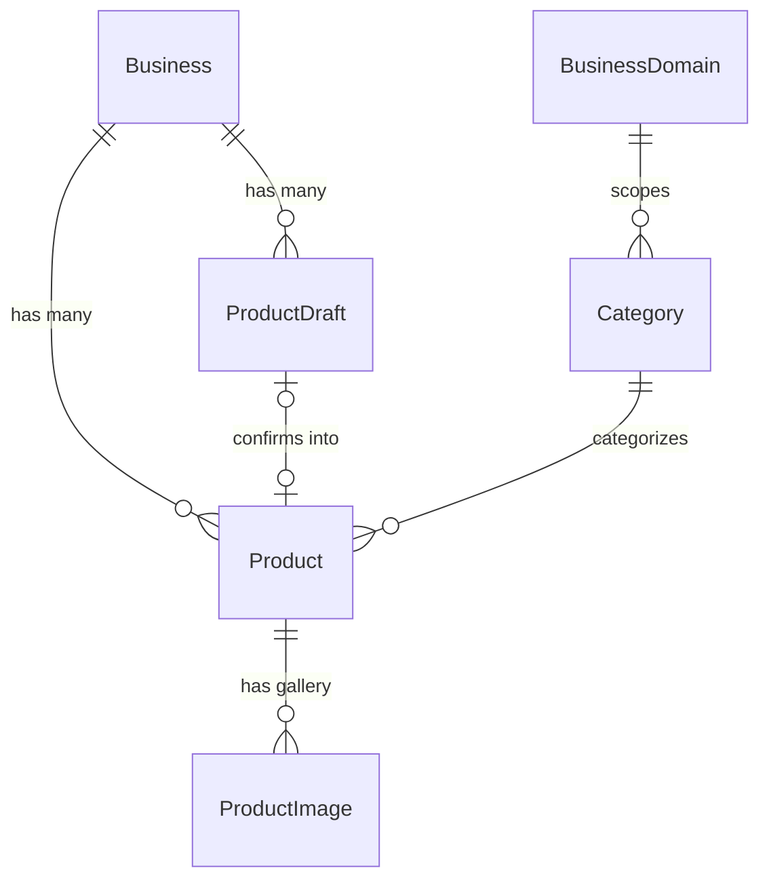

# Product Creation and Management

Products can be created and edited two ways: manually, through a form-backed
create/update endpoint, or conversationally, through the
[AI product-creation chat](../ai/product-generation.md). Both paths converge on the
exact same service method (`BusinessDashboardService.CreateProductAsync`) and the
same validation, so a product's origin never affects how it behaves afterward. This
document covers the shared data model and the full manual CRUD surface; the AI path
is documented separately since its input pipeline (conversation, prompts, structured
decisions) is substantial enough to warrant its own document.

## Components involved

| Layer | Class | File |
|---|---|---|
| Controller | `BusinessDashboardController` | `Controllers/BusinessDashboardController.cs` |
| Service | `BusinessDashboardService` (`IBusinessDashboardService`) | `Services/BusinessDashboard/BusinessDashboardService.cs` |
| Repository | `BusinessDashboardRepository` (`IBusinessDashboardRepository`) | `Repositories/Implementations/BusinessDashboardRepository.cs` |
| Metadata validation | `ProductMetadataBuilder` (static) | `Services/BusinessDashboard/ProductMetadataBuilder.cs` |
| Image storage | `ProductImageService` (`IProductImageService`) | `Services/BusinessDashboard/ProductImageService.cs` — see [image-storage.md](../images/image-storage.md) |
| Entities | `Product`, `ProductImage`, `Category` | `Models/` |
| Validators | `SaveProductRequestValidator`, `ProductsQueryRequestValidator` | `Validators/BusinessDashboard/` |

## Authorization

`BusinessDashboardController` carries one class-level policy:

```csharp
[Route("api/businesses/{businessId:guid}/dashboard")]
[Authorize(Policy = AuthorizationPolicies.BusinessOwner)]
```

Every action requires the authenticated user to own the business named in the route.
There is no separate `Feature.Products` gating on this controller in the current
code, even though `AuthorizationPolicies.Products` /
`FeatureKeys.Products` are both defined — manual product management is not currently
metered or feature-gated the way the two AI features are. This could not be
attributed to a specific reason from the code alone; the policy exists but is unused
here.

## Data model

### `Product`
`Models/Product.cs`. Full schema in [../database.md](../database.md#product).

| Field | Type | Notes |
|---|---|---|
| `Id` | `Guid` | |
| `BusinessId` | `Guid` | FK — the owning business. |
| `CategoryId` | `Guid` | FK — must belong to the business's own domain (see [Category validity](#category-validity)). |
| `Title` | `string` | Required, max 255. |
| `Description` | `string?` | Optional; blank strings are normalized to `null`. |
| `Price` | `decimal` | Non-negative — a free item is legitimate. |
| `CompareAtPrice` | `decimal?` | Pre-discount price for a struck-through sale display; must be greater than `Price` when set. Stored as its own column rather than a derived "% off" label, so the discount math lives in one place. |
| `ImageUrl` | `string?` | Kept in sync with the main entry of `Images` for consumers that only read a single image (dashboard list, existing storefront card rendering). |
| `Sku` | `string?` | Merchant inventory code; unvalidated format, unique per business (not platform-wide). |
| `StockQuantity` | `int?` | `null` = untracked; `0` = tracked and out of stock — these are deliberately distinct. |
| `Tags` | `List<string>` | Freeform merchandising badges; never null, empty list means none. |
| `SaleEndsAt` | `DateTime?` | Promotion deadline; not required to correlate with `CompareAtPrice` being set. |
| `Metadata` | `JsonDocument?` | Domain-specific attributes (see [Metadata](#metadata)). |
| `Images` | `ICollection<ProductImage>` | The gallery — see below. |

### `ProductImage`
`Models/ProductImage.cs`. A separate table rather than a JSON array on `Product`,
specifically so width/height are real typed columns, gallery order has a real sort
key, and "exactly one main image per product" is a constraint the database itself
enforces (see [database.md](../database.md#productimage)).

| Field | Type | Notes |
|---|---|---|
| `Id` | `Guid` | |
| `ProductId` | `Guid` | FK. |
| `Url` | `string` | Relative URL, from a prior upload. |
| `IsMain` | `bool` | Exactly one `true` per product — enforced by both the validator and a database constraint. |
| `Width` / `Height` | `int?` | Optional, supplied by the client, not verified server-side against the actual file. |
| `AltText` | `string?` | Falls back to the product title when null. |
| `DisplayOrder` | `int` | Gallery sort position; not required to be contiguous. |

### Metadata

`Product.Metadata` holds domain-specific attributes that vary too much between
verticals to be fixed columns — colors/sizes/material for fashion,
ingredients/spicy for restaurant, brand/storage/ram for electronics. It's a real
MariaDB `json` column (not a serialized string), which requires
`Pomelo.EntityFrameworkCore.MySql.Json.Microsoft` and `UseMicrosoftJson()` in
`Program.cs` — without that plugin EF cannot map `JsonDocument` to a column at all.

What keys are allowed, per business, comes from `Business.MetadataShape` — a snapshot
taken at onboarding time of the domain's `ProductAttributeDefinition` catalogue (see
`Models/ProductAttributeDefinition.cs`). This is a platform-level catalogue of
possible fields per business domain (Fashion, Restaurant, Electronics, ...), not
something a business defines itself — the intent, per the model's doc comment, is
that letting each business invent arbitrary JSON keys would make every product's
metadata unqueryable and un-renderable across different storefronts.

**`ProductMetadataBuilder.Build(metadataShape, submitted)`** is the single point that
turns a submitted `Dictionary<string, JsonElement>` into the stored `JsonDocument`:

1. `ReadShape(metadataShape)` parses the business's snapshotted field rules
   (`{ key, valueType, isRequired, allowedValues }`) into a lookup.
2. Any submitted key not present in that lookup throws
   `InvalidProductMetadataException` — an unknown key is rejected outright, not
   silently dropped, since the merchant explicitly submitted it.
3. For each field the business actually has, if a value was submitted, it's coerced
   to that field's declared `ProductAttributeValueType`:

| `ValueType` | Coercion | Failure |
|---|---|---|
| `Text` | Trimmed string; blank → `null` (field omitted) | `JsonValueKind` must be `String`, else `InvalidProductMetadataException` |
| `Number` | `decimal` | Must be `JsonValueKind.Number` |
| `Boolean` | `bool` (an unchecked box is stored as `false`, not dropped — for a yes/no field, `false` is real information, unlike an unanswered text box) | Must be `True`/`False` |
| `TextList` | Trimmed, non-blank strings | Must be a `JsonValueKind.Array` of strings |
| `ColorList` | Trimmed, uppercased hex strings, validated against `^#[0-9A-Fa-f]{6}$` | Must be a `JsonValueKind.Array` of strings, each a valid hex code, else `InvalidProductMetadataException` naming the offending value |

4. If the field declares `AllowedValues`, the coerced value(s) are checked against
   that closed set (case-insensitive) — a value outside it throws
   `InvalidProductMetadataException` rather than being silently dropped, since a
   merchant believing their product has a colour it doesn't actually have would be
   worse than an error.
5. `null` (left-blank) values are omitted from the result entirely — a field simply
   doesn't appear on the product, which is different from being invalid.
6. Returns `null` if nothing remains, otherwise the serialized `JsonDocument`.

`ReadShape` is also reused directly by the [AI product-creation
pipeline](../ai/product-generation.md) (`ProductAiService.FindMissingFields`,
`StripDisallowedMetadata`) so both entry points enforce identical rules from the same
source of truth.

## Category validity

A category belongs to exactly one `BusinessDomain`, and a business belongs to
exactly one domain — the invariant "a Fashion business must not use a Restaurant
category" is expressed as `product.Category.BusinessDomainId ==
product.Business.BusinessDomainId`. MariaDB cannot express this as a `CHECK`
constraint (it would need a subquery), so it's enforced in the application layer via
`IBusinessDashboardRepository.CanUseCategoryAsync`, called from
`BusinessDashboardService.EnsureCategoryIsUsableAsync` on every create/update. The
query also allows either a shared platform category (`Category.BusinessId == null`)
or the requesting business's own private custom category
(`Category.BusinessId == businessId`) — never another business's private category. A
failure throws `InvalidProductCategoryException`.

## Method documentation — `BusinessDashboardService`

### `GetProductFormAsync(Guid businessId, CancellationToken)`

**Purpose**: Supplies what the product create/edit form needs to render: usable
categories and this business's configured optional metadata fields.

**Process**: Loads `(MetadataShape, Categories)` via
`IBusinessDashboardRepository.GetProductFormDataAsync` (throws
`BusinessNotFoundException` if the business doesn't exist), then converts
`MetadataShape`'s raw JSON into `List<ProductFormFieldResponse>` via the private
`ReadMetadataFields` helper.

**Returns**: `ProductFormResponse { Categories, MetadataFields }` — one endpoint
rather than two, so a modal has everything it needs before it renders instead of
popping up half-built.

### `GetProductAsync(Guid businessId, Guid productId, CancellationToken)`

**Purpose**: Fetches one product for the edit form or detail view.

**Process**: `IBusinessDashboardRepository.GetProductAsync` — scoped to both
`productId` and `businessId` together (matching on id alone would let one business
read another's product); throws `ProductNotFoundException` if not found.

**Returns**: `BusinessProductDetailResponse` — the full editable shape (description,
`categoryId`, full image gallery, metadata), as opposed to the lighter
`BusinessProductResponse` used for list views.

### `CreateProductAsync(Guid businessId, SaveProductRequest request, CancellationToken)`

**Purpose**: Creates a new product. This is the method both the manual "Save
product" endpoint and the AI-confirmation flow (`ProductAiService.ConfirmAsync`)
call — the single point where a `products` row is ever inserted from application
code.

| Parameter | Type | Description |
|---|---|---|
| `businessId` | `Guid` | Owning business. |
| `request` | `SaveProductRequest` | The full product payload (see [DTOs](#request--response-dtos)). |

**Process**:
1. Loads `formData` (metadata shape + categories) via
   `GetProductFormDataAsync`; throws `BusinessNotFoundException` if the business
   doesn't exist.
2. `EnsureCategoryIsUsableAsync` — see [Category validity](#category-validity).
3. `BuildProductImages(request.Images)` converts each `ProductImageRequest` into a
   `ProductImage` with a fresh `Id`, trimmed `Url`, `DisplayOrder` = submission index
   (gallery order is controlled purely by how the merchant arranges images in the
   form, not a separate field), and blank `AltText` normalized to `null`. The
   validator (see below) already guarantees 1–5 images with exactly one `IsMain`, so
   `images.First(i => i.IsMain)` is always safe here without an extra null check.
4. Constructs the `Product`: `Title`/`Sku` trimmed, `Description` blank-normalized to
   `null`, `Tags` deduplicated (case-insensitive) and blank-filtered via
   `NormalizeTags`, `ImageUrl` set from the main image (kept in sync with `Images`),
   `Metadata` built via `ProductMetadataBuilder.Build`.
5. Persists via `IBusinessDashboardRepository.CreateProductAsync`.
6. Returns the freshly created product by calling `GetProductAsync` again — ensures
   the response reflects exactly what a subsequent read would return (category name
   resolved, images in their stored shape), rather than hand-assembling a response
   from the in-memory entity.

**Exceptions**: `BusinessNotFoundException` (NotFound), `InvalidProductCategoryException`
(Validation), `InvalidProductMetadataException` (Validation, from
`ProductMetadataBuilder`).

### `UpdateProductAsync(Guid businessId, Guid productId, SaveProductRequest request, CancellationToken)`

**Purpose**: Full replace-style update of an existing product — the same DTO as
creation is reused deliberately, since the editable field set is identical and two
separate DTOs would just be two shapes to keep in sync for no behavioral difference.

**Process**:
1. `IBusinessDashboardRepository.GetTrackedProductAsync` — loads the product **with
   its `Images` included and tracked**, since the update path fully replaces the
   gallery. Throws `ProductNotFoundException` if not found.
2. Loads `formData`; `EnsureCategoryIsUsableAsync`.
3. `BuildProductImages` for the new gallery.
4. Overwrites every scalar field on the tracked entity (same normalization as
   creation).
5. `IBusinessDashboardRepository.ReplaceProductImagesAsync(product, images)` —
   explicitly `RemoveRange`s the old `ProductImage` rows and `Add`s the new ones
   through the `DbSet` directly, rather than mutating `product.Images` in place
   (`Clear()` + `Add()`). The code comment explains why: a freshly constructed
   `ProductImage` already carries a real, client-generated `Guid`, so attaching it
   purely via navigation fix-up would leave EF Core's change tracker to *guess*
   whether it's a new row or an existing one it simply hasn't seen — and it guesses
   wrong (existing), producing an `UPDATE` for a row that was never inserted. Going
   through the `DbSet` directly makes `Added` mean `INSERT` and `Removed` mean
   `DELETE` unambiguously. This same call also flushes the scalar changes made in
   step 4, in one `SaveChangesAsync`/one round trip.
6. Returns the updated product via `GetProductAsync`, same reasoning as creation.

**Full replace, not merge**: every field in `request` overwrites the corresponding
column, and the entire image gallery is replaced — there is no partial-patch
semantics anywhere in this method.

### `DeleteProductAsync(Guid businessId, Guid productId, CancellationToken)`

**Purpose**: Deletes a product.

**Process**: Loads the tracked product (`ProductNotFoundException` if missing), then
`IBusinessDashboardRepository.DeleteProductAsync` removes it. **The image file itself
is deliberately left on disk** — the code comment explains that deleting it here
would be wrong if the same URL were ever reused, and treats orphaned files as a
cleanup concern rather than a correctness one. See
[image-storage.md](../images/image-storage.md#no-deletion-path) for the storage-side
implications.

### `GetProductsAsync(Guid businessId, ProductsQueryRequest query, CancellationToken)`

**Purpose**: Paged, filterable, sortable product listing for the dashboard's product
table.

**Process** (`IBusinessDashboardRepository.GetProductsAsync`): starts from
`Products.Where(BusinessId == businessId)`; optionally filters by `Search` (a `LIKE
%term%` match against `Title`) and by `Category` — **filtered by category *name*, not
id**, because the dashboard's category filter dropdown is populated from the
`ProductsByCategory` dashboard stat, which is name-keyed; the code comment notes this
is kept as-is so the existing merchant UI keeps working, while the separate public
storefront API filters by `categoryId` instead. Sorts by `ProductSortField`
(`CreatedAt` default, or `Title`/`Price`), ascending or descending per
`SortDescending`. Pages via `Skip`/`Take`.

**Returns**: `PagedResult<BusinessProductResponse>` — the lighter list-view DTO
(no description, no full gallery, no metadata).

### `ReadMetadataFields` (private static)

Parses `Business.MetadataShape`'s `fields` array into
`List<ProductFormFieldResponse>` for the form endpoint — a structurally identical,
independently-implemented sibling to `ProductMetadataBuilder.ReadShape`, since the
two produce different output shapes (form-facing DTO vs. internal `FieldRule`) from
the same underlying JSON.

## Request / response DTOs

| DTO | Direction | Purpose |
|---|---|---|
| `SaveProductRequest` | In (create + update) | `Title`, `Description?`, `Price`, `CompareAtPrice?`, `CategoryId`, `Images: List<ProductImageRequest>`, `Sku?`, `StockQuantity?`, `Tags?`, `SaleEndsAt?`, `Metadata?`. |
| `ProductImageRequest` | In (nested) | `Url` (must reference a prior upload — never raw bytes), `IsMain`, `Width?`, `Height?`, `AltText?`. |
| `ProductsQueryRequest` | In (query string) | Extends `PagedQuery`; `Search?`, `Category?`, `SortBy: ProductSortField`, `SortDescending`. |
| `BusinessProductResponse` | Out (list) | `Id`, `Title`, `Category` (name), `Price`, `CompareAtPrice?`, `ImageUrl?`, `StockQuantity?`, `CreatedAt`. |
| `BusinessProductDetailResponse` | Out (detail/edit) | Everything in the list DTO plus `Description`, `CategoryId`, full `Images: List<ProductImageResponse>`, `Sku`, `Tags`, `SaleEndsAt`, `Metadata`, `UpdatedAt`. |
| `ProductImageResponse` | Out (nested) | `Id`, `Url`, `IsMain`, `Width?`, `Height?`, `AltText?`, `DisplayOrder`. |
| `ProductFormResponse` | Out | `Categories: List<ProductFormCategoryResponse>`, `MetadataFields: List<ProductFormFieldResponse>`. |
| `ProductImageUploadResponse` | Out (image upload) | `ImageUrl` — the relative URL to send back in a subsequent `SaveProductRequest.Images`. |

## Validation

`SaveProductRequestValidator` (FluentValidation, run via
`IValidator<SaveProductRequest>.ValidateAndThrowAsync` in the controller before the
service is even called):

| Field | Rule |
|---|---|
| `Title` | Required, max 255. |
| `Price` | `>= 0` (a free item is legitimate) and `< 100,000,000` — mirrors `products.Price` being `decimal(10,2)`, so a larger value would otherwise be silently truncated or throw at the database. |
| `CompareAtPrice` | When set: `> Price` and `< 100,000,000` — mirrors the database's `CK_products_CompareAtPrice_GreaterThanPrice` check constraint, so a bad value is rejected with a clear message here instead of a raw constraint-violation error surfacing from the database. |
| `CategoryId` | Required (non-empty). |
| `Images` | Non-empty, at most 5, exactly one `IsMain`. |
| `Images[].Url` | Required, max 500. |
| `Images[].AltText` | Max 255. |
| `Sku` | Max 100. |
| `StockQuantity` | When set: `>= 0` — mirrors `CK_products_StockQuantity_NonNegative`. |
| `Tags[]` | Each non-empty, max 50. |
| `Tags` | At most 20 entries. |

Whether each metadata key is enabled for the business, and whether its value matches
the declared type, is **not** checked here — the validator has no access to the
business's metadata shape, so that check happens in the service via
`ProductMetadataBuilder.Build`, as documented above.

`ProductsQueryRequestValidator` extends the shared `PagedQueryValidator<T>` (see
[../services/services.md](../services/services.md)) and additionally bounds `Search`
(max 255), `Category` (max 100), and requires `SortBy` to be a valid
`ProductSortField` enum value.

## Business/product relationships



See [../database.md](../database.md) for the complete schema, including nullability,
FKs, and constraints for every entity referenced here.

## Error handling summary

| Condition | Exception | `ErrorType` |
|---|---|---|
| Business doesn't exist | `BusinessNotFoundException` | `NotFound` |
| Product doesn't exist / belongs to another business | `ProductNotFoundException` (reused from `Exceptions/Storefront`) | `NotFound` |
| Category not usable by this business | `InvalidProductCategoryException` | `Validation` |
| Metadata key not enabled, wrong type, or outside its allowed set | `InvalidProductMetadataException` | `Validation` |
| `SaveProductRequest` fails FluentValidation | Validation failure (see [../error-handling.md](../error-handling.md)) | `Validation` |
| Uploaded image empty, too large, or fails signature verification | `InvalidProductImageException` | `Validation` |

## Related documents

- [../ai/product-generation.md](../ai/product-generation.md) — the conversational
  path to `CreateProductAsync`.
- [../images/image-storage.md](../images/image-storage.md) — `ProductImageService`,
  upload validation, and how stored files are served.
- [../database.md](../database.md) — full schema for `Product`, `ProductImage`,
  `Category`, `ProductAttributeDefinition`.
- [../api/endpoints.md](../api/endpoints.md#businessdashboardcontroller) — full
  route/status-code reference.
